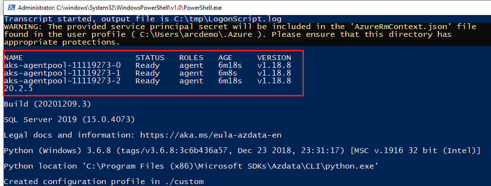
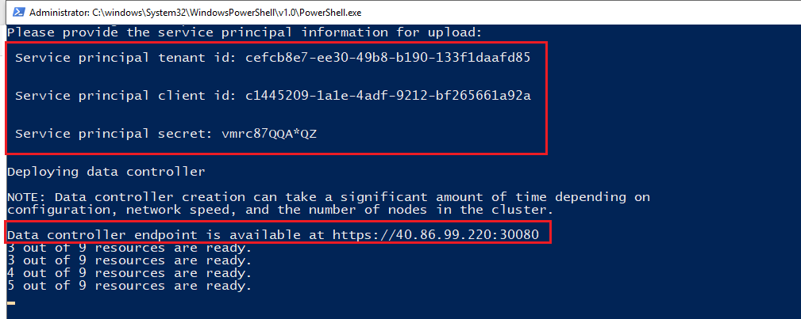

# Exercise 1 : Getting Started with Azure

## Instructions

1. Once the environment is provisioned, a virtual machine (JumpVM) and lab guide will get loaded in your browser. Use this virtual machine throughout the workshop to perform the the lab.

2. To get the lab environment details, you can select **Lab Environment** tab. Additionally, the credentials will also be emailed to your email address provided at registration.
 
    > You will see Deployment ID value on **Lab Environment** tab, use it whereever you see SUFFIX or DeploymentID in lab steps.
 
3. You can also open the Lab Guide on Seprate full window by selcting the **Arrow** icon in upper right corner.
 
## Login to Azure Portal

1. In the JumpVM, click on Azure portal shortcut of Microsoft Edge browser which is created on desktop.
   
2. When you click on Azure portal, edge browser welcome screen will come up, select **Get started**.

   
   
3. On next window, click on **Confirm**.

   
   
4. Now, you can close the popup which is coming up.

   
   
5. Now, you will see two tabs in edge browser, close first tab named with **Microsoft Edge**.

   
   
6. On **Sign in to Micsoft Azure** tab you will see login screen, in that enter following email/username and then click on **Next**. 
   * Email/Username: <inject key="AzureAdUserEmail"></inject>
   
     
     
7. Now enter the following password and click on **Sign in**.
   * Password: <inject key="AzureAdUserPassword"></inject>
   
     
     
8. If you see the pop-up **Stay Signed in?**, click No

9. If you see the pop-up **You have free Azure Advisor recommendations!**, close the window to continue the lab.

10. If a **Welcome to Microsoft Azure** popup window appears, click **Maybe Later** to skip the tour.
   
12. Now you will see Azure Portal Dashboard, click on **Resource groups** to see the resource groups.

    
   
13. Confirm you have all resource group are present as shown below.

    
   
14. Now, click on the **Next** from lower right corner to move on **Getting Started** page.

## Deploying Azure Arc Data controller on to Azure Kubernetes Cluster(AKS) 

1. After login to the server VM Azure Data controller deployment script will start automatically in the Powershell command window.

2. The script will take care of initial configuration and connectivity to Azure Kubernetes Services (AKS) using Azure CLI with pre-configured data.

   

3. Command line will prompt to enter the following information provided in the Lab Environment tab
   
  
   - **Service principal tenet id:**

   - **Service principal client id:**

   - **Service principal secret:**

   

4. After entering 3 service principal details Azure Data Controller deployment on to AKS cluster will starts.

5. In the middle of the Azure Data Controller deployment it will display data controller endpoint URL.

   

6. Then a total of 9 Data controller resources will be deployed on to the AKS cluster after successful deployment command prompt will close automatically.