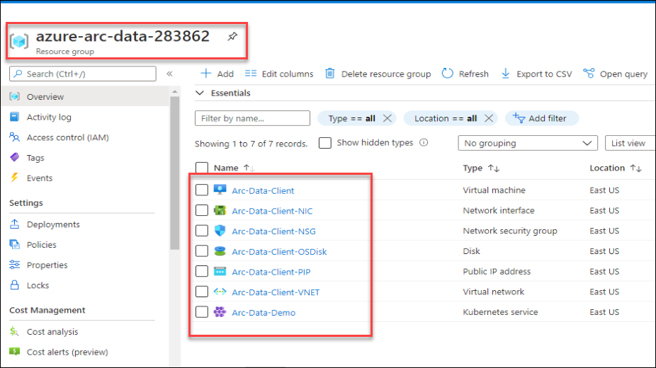

# Exercise 1: Getting Started with Azure

## Instructions

1. Once the environment is provisioned, a virtual machine (JumpVM) and lab guide will get loaded in your browser. Use this virtual machine throughout the workshop to perform the lab.

2. To get the lab environment details, you can select the **Lab Environment** tab. Additionally, the credentials will also be emailed to your email address provided at registration.
 
    > You will see Deployment ID value on **Lab Environment** tab, use it wherever you see SUFFIX or DeploymentID in lab steps.
 
3. You can also open the Lab Guide on Separate full window by selecting the **Arrow** icon in the upper right corner.
 
## Login to Azure Portal

1. In the JumpVM, click on the Azure portal shortcut of Microsoft Edge browser which is created on the desktop.
   
2. When you click on Azure portal, the edge browser welcome screen will come up, select **Get started**.

   
   
3. On the next window, click on **Confirm**.

   
   
4. Now, you can close the popup which is coming up.

   
   
5. Now, you will see two tabs in the edge browser, close the first tab named **Microsoft Edge**.

   
   
6. On the **Sign in to Microsoft Azure** tab, you will see the login screen, enter the following email/username, and, then click on **Next**. 
   * Email/Username: <inject key="AzureAdUserEmail"></inject>
   
     
     
7. Now enter the following password and click on **Sign in**.
   * Password: <inject key="AzureAdUserPassword"></inject>
   
     
     
8. If you see the pop-up **Stay Signed in?**, click on No

9. If you see the pop-up **You have free Azure Advisor recommendations!**, close the window to continue the lab.

10. If a **Welcome to Microsoft Azure** popup window appears, click **Maybe Later** to skip the tour.
   
12. Now you will see Azure Portal Dashboard, click on **Resource groups** to see the resource groups.

    
   
13. Confirm you have all resource groups present as shown below.

    
   
   * In the Resource group we have one Virtual manchine and a Kubernetes Service resources deployed. 
   * We will be using the Virtual Machine to Perform all the Lab exercises as a JumVM.
   * We have already deployed the Azure Arc Data controller on to the Kubernetes Service and in later exercises we will be deploying Azure arc enabled data resources on to the kubernetes cluster using Azure Arc data services.
   
   
## Azure Arc Data controller on to Azure Kubernetes Cluster(AKS) 

  * We have already deployed the Azure Arc Data controller on to Azure kubernetes Cluster using a automation script. You will be logging in to Azure Arc Data controller in next exercise. Also we are using **direct** connectivity mode for the Azure Arc enabled data services environment to Azure.
  
  * There are multiple modes available to connect to Azure. if the Azure Arc enabled data services are directly connected to Azure, then users can use Azure Resource Manager APIs, the Azure CLI, and the Azure portal to operate the Azure Arc data services. The experience in directly connected mode is much like how you would use any other Azure service with provisioning/de-provisioning, scaling, configuring, and so on all in the Azure portal.
   
   -    To know more about the connectivity modes, you can refer the following document: https://docs.microsoft.com/en-us/azure/azure-arc/data/connectivity
