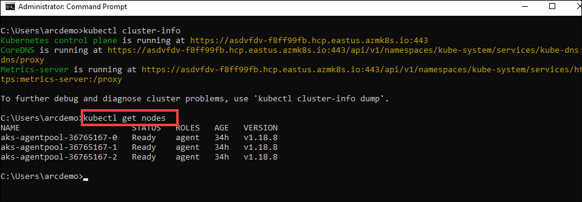
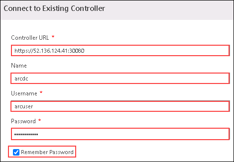
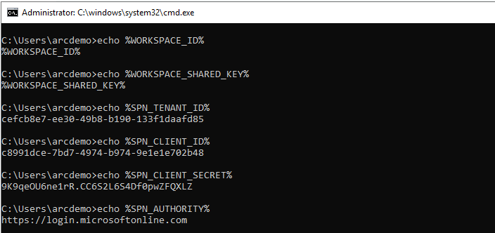

# Exercise 2: Getting Started with Azure Arc enabled data services 

Duration: 20 minutes

In this exercise, you will get familiar with the existing Kubernetes cluster and connect to the data controller and verify the status of Azure Arc data controller. You will be deploying Log anaytics workspace in azure portal to see the azure arc resources logs. 

## Task 1: Getting started with the existing Kubernetes cluster 

1. On the JumpVM provided on the left side, launch the **Command Prompt** by double clicking on the cmd shortcut on the desktop.
  
    

1. Now the command prompt windows will open up. In the command prompt, run the following command to retrieve the kubernetes cluster info.

   ```BASH
   kubectl cluster-info
   ```
   
 
1. Run the following command to list the current namespaces in the cluster. A namespace in Kubernetes creates a logical isolation boundary.

   ```BASH
   kubectl get namespace
   ```

1. A node is a worker machine in Kubernetes and may be either a virtual or a physical machine, depending on the cluster. Each Node is managed by the Master. A Node can have multiple pods, and the Kubernetes master automatically handles scheduling the pods across the Nodes in the cluster. 
  
   Run the following command to see the status of the kubernetes node.

   ```BASH
   kubectl get nodes
   ```
   
   
   
1. Now, run the following command to get the list of all pods in all namespaces. 
 
   ```BASH
   kubectl get pods -A
   ```
   
   

1. Run the following command to get the detailed information of a specific pod. 

   > **Note**: In the below command, please replace the pod name and namespace name with any pod name and the corresponding namespace from the previous command's output.

   ```BASH
   kubectl describe pod <pod name> -n <your namespace name>
   ```
   
   
   
  > **Note**: Additionally, you can explore and learn more about kubernetes from the following links - https://docs.microsoft.com/en-us/learn/modules/aks-workshop/, https://aksworkshop.io
  
## Task 2: Connect to the data controller using Azure Data Studio/ Azure Data CLI.

In this task, you will learn how to connect to the data controller using Azure Data Studio and Azure Data CLI

In the environment provided, already the Azure Arc Data controller is deployed on to the Kubernetes Cluster. We are using **direct** connectivity mode for the Azure Arc enabled data services environment to Azure.
  
There are multiple modes available to connect to Azure. if the Azure Arc enabled data services are directly connected to Azure, then users can use Azure Resource Manager APIs, the Azure CLI, and the Azure portal to operate the Azure Arc data services. The experience in directly connected mode is much like how you would use any other Azure service with provisioning/de-provisioning, scaling, configuring, and so on all in the Azure portal.
   
If you want to know more about the connectivity modes, you can refer the following document: https://docs.microsoft.com/en-us/azure/azure-arc/data/connectivity

1. First, you will see how to connect to the data controller using Azure Data CLI.

1. On your JumpVM, open a **Command Prompt** window from the desktop shortcut if not already opened.

1. Run the following command in the command prompt window.

   ```BASH
   azdata login
   ```
   
   
   
1. When prompted to enter the Namespace, copy the value of Arc DC Name from the Environment details page. After executing the command, copy the data controller service API endpoint URL value from the output.

   
   
   
   
1. Now you are logged in to the Azure Arc data controller.

1. Next, you will see how to connect to Azure Arc Data controller using Azure data studio.

1. On your Lab VM, open **Azure Data studio** from the desktop shortcut and select **Connections**.

   
   
1. In the **Connections** panel under **Azure Arc Controllers**, click on **Connect Controller**.

1. In the **Connect to Controller** page, provide the following details and click on **Connect**.

   - **Controller URL**: Enter the Azure Arc data controller service API endpoint URL value which you copied earlier 
   
   - **Name** : Enter arcdc
   
   - **Username** : Enter arcuser
   
   - **Password** : Enter Password.1!!
   
   - Select the Remember Password checkbox
   
     
    
1. Once the connection is successful, you can see the Azure Arc data controller listed under Azure Arc Controllers on the bottom left of the Azure Data Studio.

    

## Task 3: Monitor with Data Controller Dashboard

Now that you are connected to an Azure Arc data controller, you can view the dashboards for the data controller and any SQL managed instances or PostgreSQL Hyperscale server group resources that you have.

1. In the **Connections** panel, under **AZURE ARC CONTROLLERS**, right-click on the **arcdc** data controller and select **Manage**.

   > **Note**: You will see that there is no Azure Arc Resources. This is because you have not deployed any resource on the Azure Arc data services environment. In the next exercises, you will be deploying the resources.

   

1. Currently, you are in the Azure Arc Data Controller dashboard. Now, you can see details about the data controller such as Name of the Arc Data Controller, Region where it is deployed, Connection mode, Resource Group, Subscription ID of the Azure Subscription, Controller Endpoint, and Namespace. You will also see that we have deployed using the Direct connection mode of Azure Arc Data controller.

   
   
   > **Note**: If you click on **Open in Azure portal** button from the menu on the top, you will not able to find the resources because we have not yet uploaded any logs to the Azure portal and without uploading any logs to azure, you will not be able to view the Azure Arc data controller resource in Azure portal.
   

## Task 4: Create Log anaytics workspace to upload logs, metric and usages to Azure Monitor. 

In this task you will create a log analytics workspace to upload logs for your Azure Arc enabled SQL managed instances and Azure Arc enabled PostgreSQL Hyperscale server groups to Azure Monitor and view your logs in Azure portal.

1. In the command prompt run the following command to login to azure. On the sign-in page enter the username and password, you can find the username and password from the environment details tab.

   ```BASH
   az login
   ```

   

1. In the command prompt run the following command to create a log analytics workspace. 

    > **Note**: Please make sure to replace the SUFFIX with **azure-arc-data-SUFFIX** and workspace name. You can find resource group name from the environment details tab and for workspace name enter a globally unique value.

   ```BASH
   az monitor log-analytics workspace create --resource-group azure-arc-data-SUFFIX --workspace-name <Unique name of workspace>
   ```

    

1. From the output window copy the **customerID** value and save the value locally in the text file, you will use these values in the later part of the lab.


1. Now, run the following command to retrieve the access keys required to connect to your log analytics workspace. Make sure to replace resource group name and workspace name

   ```BASH
     az monitor log-analytics workspace get-shared-keys --resource-group MyResourceGroup --workspace-name <Unique name of workspace>
   ```

   
   
1. From the output window copy the **"primarySharedKey** value and save the value locally in the text file, you will use these values in the later part of the lab.

1. In the command prompt, replace the **customerId**, **primarySharedKey** in the following command with the values which you copied earlier and then run it. This command saves the customerId and primarySharedKey values in an environment variable to later use in the lab.

   ```BASH
   SET WORKSPACE_ID=<customerId>
   SET WORKSPACE_SHARED_KEY=<primarySharedKey>
   ```

   

1. Run the following command to set the SPN authority URL in an environment variable.

   ```BASH
   SET SPN_AUTHORITY=https://login.microsoftonline.com
   ```

   

1. Now run the following command to make sure that all environment variables required are set.

   ```BASH
   echo %WORKSPACE_ID%
   echo %WORKSPACE_SHARED_KEY%
   echo %SPN_TENANT_ID%
   echo %SPN_CLIENT_ID%
   echo %SPN_CLIENT_SECRET%
   echo %SPN_AUTHORITY%
   ```
   > **Note**: We have already added the variables of Service principal details in the environment for you, so you dont have to set the environment variables again.
  
   


1. Now you have created the **Log Analytics workspaces** but you can't upload any usages or logs because we don't have any resources created under Azure Arc data controller. we will deploy the resources and upload the Logs and usages in next exercises.  

   
In this exercise, you have covered the following:
 
   - Deploying Azure Arc Data controller on to Azure Kubernetes Cluster(AKS) 
   - Getting started with the existing Kubernetes cluster
   - Connect to the data controller using Azure Data Studio/ Azure Data CLI
   - Monitor with Data Controller Dashboard


   
