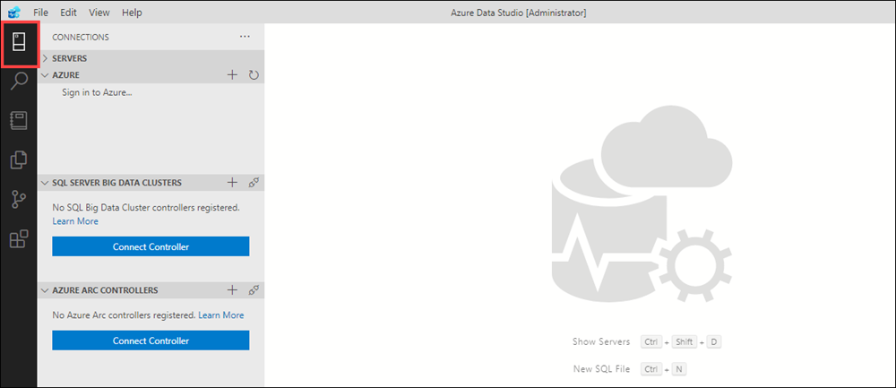

# Exercise 2: Getting Started with Azure Arc enabled data services 

Duration: - 

In this exercise, you will get familiar with the existing Kubernetes cluster and connect to the data controller and verify the status 

## Task 1: Getting started with the existing Kubernetes cluster 

1. 

## Task 2: Connect to the data controller using Azure Data Studio/ Azure CLI.

In this task you will learn how to connect to the data controller using Azure Data Studio

1. On your LabVM  launch a **Command Prompt** window (Select search on the task bar, type cmd, and select Enter).

1. Enter the following command at the command prompt.

   ```BASH
   azdata login
   ```
   
   
   
1. When prompted enter the Namespace, you can find the Namespace from the Environment details page. Copy the data controller service API endpoint URL value from the output.

   
   
   

1. Now on your LabVM open **Azure Data studio** and select **Connections**.

   
   
1. In **Connections** panel under **Azure Arc Controllers** click on Connect Controller.

1. In **Connect to Controller** page enter the following details and click on **Connect**.

   - **Controller URL**: Enter the data controller service API endpoint URL value which you copied earlier 
   
   - **Name** : Enter arcdc
   
   - **Username** : Enter acdcuser
   
   - **Password** : Enter Password.1!!
   
     
    
1. Once Connection is successful, you can see arc data controller listed under Arc Controllers.

    

## Task 3: Monitor with Data Controller Dashboard

Now that you are connected to a data controller, you can view the dashboards for the data controller and any SQL managed instances or PostgreSQL Hyperscale server group resources that you have.

1. In the **Connections** panel, under **Arc Controllers** right-click on the  arcdc data controller and select **Manage**.

1. In the Azure Arc Data Controller dashboard, you can see details about the data controller resource such as name, region, connection mode, resource group, subscription, controller endpoint, and namespace.

1. 

## Task 4: Upload usage data, metrics, and logs to Azure Monitor 

In this task you will create a log analytics workspace, upload logs for your Azure Arc enabled SQL managed instances and AzureArc enabled PostgreSQL Hyperscale server groups to Azure Monitor and view your logs in Azure portal

1. In your LabVM open a command prompt and run the following command to create a log analytics workspace. 

   >**Note**: Please make sure to replace resource group name and workspace name. You can find resource group name from the environment details tab and for workspace name enter a globally unique value.

   ```BASH
   az monitor log-analytics workspace create --resource-group <resource group name> --workspace-name <some name you choose>
   ```

1. From the output window copy the **customerID** value and save the value locally in the text file, you will use this values in the later part of the lab.

1. Now run the following command to retrive the access keys required to connect to your log analytics workspace. Make sure to replace resource group name and workspace name

   ```BASH
   az monitor log-analytics workspace get-shared-keys --resource-group <resource group name> --workspace-name <your workspace name>
   ```
   
1. From the output window copy the **"primarySharedKey** value and save the value locally in the text file, you will use this values in the later part of the lab.

1. In the command prompt, replace the **customerId**, **primarySharedKey** in the following command with the values which you copied earlier and run it. This command saves the customerId and primarySharedKey values in an environment variable to use later in the lab.

   ```BASH
   SET WORKSPACE_ID=<customerId>
   SET WORKSPACE_SHARED_KEY=<primarySharedKey>
   ```

1. Now run the following command to save the appId, password, and tenant values in an environment variable to use later in the lab. 

   >**Note**: Make sure to replace appId, password, and tenant values. You can get the values from the environment details tab 

   ```BASH
   SET SPN_CLIENT_ID=<appId>
   SET SPN_CLIENT_SECRET=<password>
   SET SPN_TENANT_ID=<tenant>
   ```
1. Run the following command to set the SPN authority URL in an environment variable.

   ```BASH
   SET SPN_AUTHORITY=https://login.microsoftonline.com
   ```

1. Now run the following command to make sure that all environment variables required are set.

   ```BASH
   echo %WORKSPACE_ID%
   echo %WORKSPACE_SHARED_KEY%
   echo %SPN_TENANT_ID%
   echo %SPN_CLIENT_ID%
   echo %SPN_CLIENT_SECRET%
   echo %SPN_AUTHORITY%
   ```
1. In the command prompt run the following to log in to to the Azure Arc data controller. Follow the prompts to set the namespace, the administrator username, and the password.

   ```BASH
   azdata login
   ```

1. Export all logs to the specified file:

   ```BASH
   azdata arc dc export --type logs --path logs.json
   ```
   
1. Upload logs to an Azure monitor log analytics workspace:

   ```BASH
   azdata arc dc upload --path logs.json
   ```
   
1. Now to view your logs in Azure portal, open the Azure portal and then search for your log analytics workspace by name in the search bar at the top and then select it.

1. In the log analytics workspace page, from the left navigation menu under **General** select **Logs** and click on **Get Started**.

1. In the logs page, expand Custom Logs at the bottom of the list of tables and you will see a table called **sql_instance_logs_CL**.

1. Select the **eye** icon next to the table name and select the **View in query editor** button.

1. Now you will have a query in the query editor that will show the most recent 10 events in the log.

1. In the query editor click on **Run**

  
   
