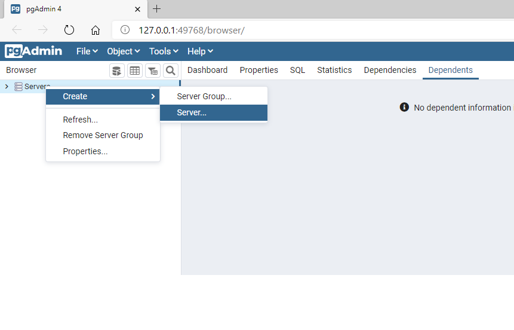
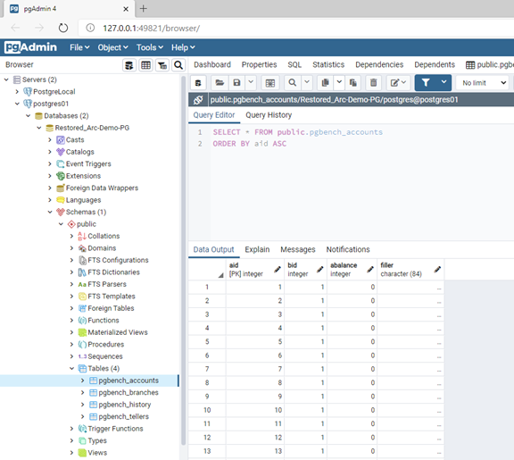

# Exercise 3: Azure Arc enabled PostgreSQL Hyperscale

Duration: -

In this exercise, you will create a Postgres Hyperscale Server group

## Task 1: Create a Postgres Hyperscale Server group and connect to the Azure Arc enabled PostgreSQL Hyperscale server group

1. In the Azure Arc Data Controller dashboard, click on **+ New Instance**.

1. From the deployment options blade, select PostgreSQL Hyperscale server group - Azure Arc. Accept the Privacy and license terms and click **Select** at the bottom.

     

1. In the Deploy PostgreSQL Hyperscale server group - Azure Arc blade, enter the following information:

   **Under General settings**
   
   - **Server group name**: Enter arcpostgres 
   
   - **Password**: Enter Password.1!!
   
   - **Number of workers**: Enter 3
   
   - **Port**: Leave it default
    
     
   
   **Under Resource settings**
  
   - **CPU request**: Enter 2
   
   - **CPU limit**: Enter 2.5
   
   - **Memory request**: Enter 2.5
   
   - **Memory limit**: Enter 2.5
   
     
   
1. Click the **Deploy** button. This starts the creation of the Azure Arc enabled PostgreSQL Hyperscale server group on the data controller.

   
   
1. Now in **Configure Python Runtime** blade, under **Installation Type** select New Python installation and click on **Next**.

   

1. In **Install Dependencies** blade click on **Install**. 

   
   
1. Once the installation is complete, in **Azure Arc Data Controller dashboard** under Azure Arc Resources you can see the newly created Postgres Hyperscale Server group.

   


**Connect on-premise source database and Azure Arc enabled PostgreSQL server**

1. In the command prompt run the following to get the Postgres servers list in AKS using the Azure Arc data controller. 
   
   ```BASH
   azdata arc postgres server list
   ```
  
   ```BASH
   Name        State    Workers
   ----------  -------  ---------
   postgres01  Ready    2

   ```

2. To get connection string details for postgres01 server endpoint run the following command.

   ```BASH
   azdata arc postgres endpoint list -n postgres01
   ```

   ```BASH
   Arc
   ======================================================================================================================
   Postgres01 Instance
   ----------------------------------------------------------------------------------------------------------------------
   Description           Endpoint

   PostgreSQL Instance   postgresql://postgres:<replace with password>@40.121.8.176:5432
   Log Search Dashboard  https://40.117.233.178:30777/kibana/app/kibana#/discover?_a=(query:(language:kuery,query:'custom_resource_name:postgres01'))
   Metrics Dashboard     https://40.117.233.178:30777/grafana/d/postgres-metrics?var-Namespace=arc&var-Name=postgres01

   ```
3. On your LabVM open the PgAdmin tool from the start menu to connect Azure arc enabled Postgres Hyperscale database 

   

4. Now connect Azure arc enabled Postgres server using above connection string details.

   

5. Under the connection tab enter the below details from the above connection string details similar to the following one.

    ```BASH
   PostgreSQL Instance   postgresql://postgres:<replace with password>@40.121.8.176:5432
   ```

   


## Task 2: Backup/Restore and Review the distribution of data 

1. On your LabVM launch a Command Prompt window Select search on the taskbar, type cmd, and select Enter.

**Verify configuration**

2. First, we need to verify that our server group has been configured to use backup storage class.
   ```BASH
   azdata arc postgres server show -n arcpostgres
   ```
   Look at the storage section of the output:
   ```BASH 
   "service": {
         "port": 5432,
         "type": "LoadBalancer"
      },
      "storage": {
         "backups": {
         "className": "default",
         "size": "5Gi"
         },
         "data": {
         "className": "default",
         "size": "5Gi"
         },
         "logs": {
         "className": "default",
         "size": "5Gi"
         }
      }
   ```
**Take a manual full backup**

3. To take a full backup of the entire data and log folders of our server group by running the following command:
   ```BASH
   azdata arc postgres backup create --name backup14122020-0408pm --server-name arcpostgres
   ```
   This command will coordinate a distributed full backup across all the nodes that constitute our Azure Arc enabled PostgreSQL Hyperscale server group.

   Where:
   - **name** indicates the name of a backup
   - **server-name** indicates a server group

   When the backup completes, the ID, name, size, state, and timestamp of the backup will be returned.
   ```BASH
   {
   "ID": "7212353a05ee45dca542da2add498270",
   "name": "backup14122020-0408pm",
   "size": "21.11 MiB",
   "state": "Done",
   "timestamp": "2020-12-14 10:39:27+00:00"
   }
   ```

   

   In the above result, "+00:00" means UTC time (UTC + 00 hour 00 minutes)

**List backups**

4. To list the backups that are available to restore.
   ```BASH
   azdata arc postgres backup list --server-name arcpostgres
   ```
   Returns an output like:
   ```BASH
   ID                                Name                   Size       State    Timestamp
   --------------------------------  ---------------------  ---------  -------  -------------------------
   7212353a05ee45dca542da2add498270  backup14122020-0408pm  21.11 MiB  Done     2020-12-14 10:39:27+00:00
   ```

   

**Restore a full backup**

5. We will restore the entire content of a backup.
   
   **Restoring the server group postgres onto itself:**
   ```BASH
   azdata arc postgres backup restore -sn postgres --backup-id 7212353a05ee45dca542da2add498270
   ```
   This operation is only supported for PostgreSQL version 12 and higher.
   
   **Restore the server group postgres to a different server group postgres01:**
   ```BASH
   azdata arc postgres backup restore -sn postgres01 -ssn postgres --backup-id 7212353a05ee45dca542da2add498270
   ```

   

   This example restores into server group **postgres**. Note that "+00" indicates the timezone of the point in time.

## Task 3: Configure & Scale, and review the distribution of data

1. On your LabVM launch a **Command Prompt** window (Select search on the taskbar, type cmd, and select Enter).

1. Run the following query to verify that you currently have three Hyperscale worker nodes, each corresponding to a Kubernetes pod.

   ```BASH
   azdata arc postgres server list
   ```
   
1. Now to scale-out **Azure Arc enabled PostgreSQL Hyperscale**,  in the command prompt run the following command. This will increase the number of worker nodes from 3 to 5.

   ```BASH
   azdata arc postgres server edit -n arcpostgres -w 4
   ```
  
   > **Note**: Wait for the command to complete 
  
1. Run the following command and verify that the server group is now using the additional worker nodes you added. In the output, you should be able to see 5 worker nodes.
   
   ```BASH
   azdata arc postgres server list
   ```

1. Once the nodes are available, the Hyperscale Shard Rebalancer runs automatically and redistributes the data to the new nodes. The scale-out operation is an online operation. While the nodes are added and the data is redistributed across the nodes, the data remains available for queries.

1. You can also scale up, from **PostgreSQL Hyperscale - Azure Arc Dashboard**. 

## Task 4: Monitor/Visualize with Azure Data Studio Dashboards

Now that you are connected to a data controller, you can view the dashboards for the data controller and any SQL managed instances or PostgreSQL Hyperscale server group resources that you have.

1. In the **Connections** panel, under **Arc Controllers** right-click on the  arcdc data controller and select **Manage**.

   

1. In the Azure Arc Data Controller dashboard, you can see Grafana and Kibana Dashboard URLs along with details about the data controller resource.

   

   Kibana and Grafana web dashboards are provided to bring insight and clarity to the Kubernetes namespaces being used by Azure Arc enabled data services. 

1. Click on the Grafana service endpoints to open the grafana dashboard. The relevant Grafana dashboards are:

   - "Azure SQL managed instance Metrics"
   - "Host Node Metrics"
   - "Host Pods Metrics"

1. Enter username and password(Same password used for Azure data controller login) to login to Grafana Dashboard

   

1. You can see all Postgres metrics like CPU usage, Memory usage, per database metrics, etc. in the Grafana dashboard.

   


## Task 5: How to migrate from different on-premises/cloud server?

Azure Arc enabled PostgreSQL Hyperscale server group is the community version of PostgreSQL and runs with the CitusData extension enabled

- Source:
   A Postgres Server running on-premises on a bare metal server and named Postgres. It is version 13 and hosts a database named Arc-Demo-PG that has 4 tables.

- Destination:
   A Postgres server running in an Azure Arc environment and named postgres01. It is version 13. It does not have any database except the standard Postgres database.

**Take a backup of the source database on-premises**

   

   Configure it:

   1. Give it a file name: Arc-Demo-Bkp

   

   1. Set the format to Custom

   

   1. The backup completes successfully:

**Create an empty database on the destination system in your Azure Arc enabled PostgreSQL Hyperscale server group**

   1. Select Create option from postgres01 database menu

   

   2. Let's name the destination database Restored_Arc-Demo-PG

   

**Restore the database in your Arc setup**

   Configure the restore:

   1. Point to the file that contains the backup to restore: Arc-Demo-Bkp

   

   2. Keep the format set to Custom or tar

   3. Click Restore.
   
   
      The restore is successful.

**Verify that the database was successfully restored in your Azure Arc enabled PostgreSQL Hyperscale server group**

   Test from psql inside our Azure Arc setup:

   Within your Arc setup you can use PgAdmin to connect to your Postgres instance, select database RESTORED_Arc-Demo-PG and query the data:

   

   - Right-click on Database and select Query tool to open a new query window and use the below query to see the results of **pgbench_accounts** table and you'll see the data that you restored from the on-premises Postgres instance:

   ```BASH
   select * from Public.pgbench_accounts;
   ```

   

