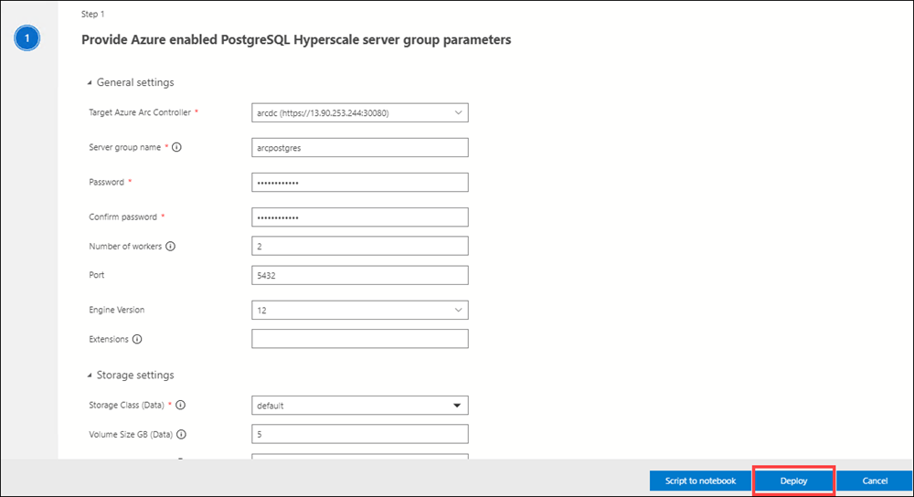
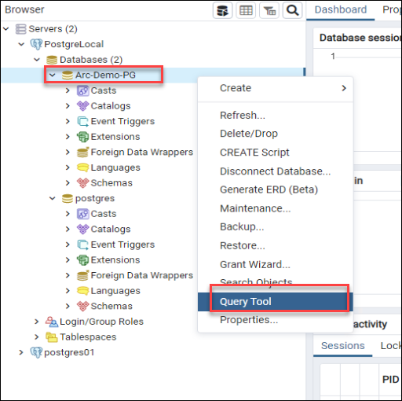

# Exercise 3: Azure Arc enabled PostgreSQL Hyperscale

Duration: -

In this exercise, you will create a Postgres Hyperscale Server group

## Task 1: Create a Postgres Hyperscale Server group and connect to the Azure Arc enabled PostgreSQL Hyperscale server group

1. In the Azure Arc Data Controller dashboard, click on **+ New Instance**.

1. From the deployment options balde, select PostgreSQL Hyperscale server group - Azure Arc. Accept the Privacy and license terms and click **Select** at the bottom.

     

1. In the Deploy PostgreSQL Hyperscale server group - Azure Arc blade, enter the following information:

   **Under Genral settings**
   
   - **Server group name**: Enter arcpostgres 
   
   - **Password**: Enter Password.1!!
   
   - **Number of workers**: Enter 3
   
   - **Port**: Leave it default
    
     
   
   **Under Resource settings**
  
   - **CPU request**: Enter 2
   
   - **CPU limit**: Enter 2.5
   
   - **Memory request**: Enter 2.5
   
   - **Memory limit**: Enter 2.5
   
     
   
1. Click the **Deploy** button. This starts the creation of the Azure Arc enabled PostgreSQL Hyperscale server group on the data controller.

   
   
1. Now in **Configure Python Runtime** blade, under **Installation Type** select New Python installation and click on **Next**.

   

1. In **Install Dependencies** blade click on **Install**. 

   
   
1. Once the installation is complete, in **Azure Arc Data Controller dashboard** under Azure Arc Resources you can see the newly created Postgres Hyperscale Server group.

   

## Task 2: Backup/Restore and Review the distribution of data 

## Task 3: Configure & Scale, and review the distribution of data

1. On your LabVM  launch a **Command Prompt** window (Select search on the task bar, type cmd, and select Enter).

1. Run the following query to verify that you currently have three Hyperscale worker nodes, each corresponding to a Kubernetes pod.

   ```BASH
      azdata arc postgres server list
   ```
   
1. Now to scale out **Azure Arc enabled PostgreSQL Hyperscale**,  in the command prompt run the following command. This will increase the number of worker nodes from 3 to 5.

   ```BASH
   azdata arc postgres server edit -n arcpostgres -w 4
   ```
  
   > **Note**: Wait for the command to complete 
  
1. Run the following command and verify that the server group is now using the additional worker nodes you added. In the output you should be able to see 5 worker nodes.
   
   ```BASH
   azdata arc postgres server list
   ```

1. Once the nodes are available, the Hyperscale Shard Rebalancer runs automatically, and redistributes the data to the new nodes. The scale-out operation is an online operation. While the nodes are added and the data is redistributed across the nodes, the data remains available for queries.

1. You can also scale up, from **PostgreSQL Hyperscale - Azure Arc Dashboard**. 

## Task 4: Monitor/Visualize with Azure Data Studio Dashboards

## Task 5: How to migrate from different cloud?
