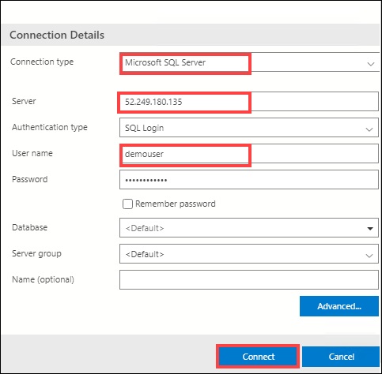
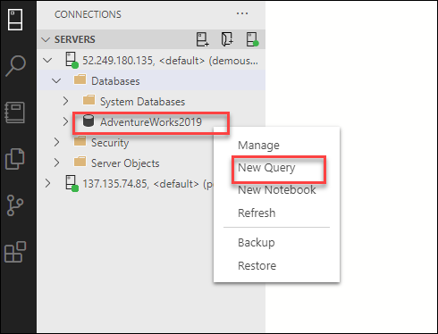
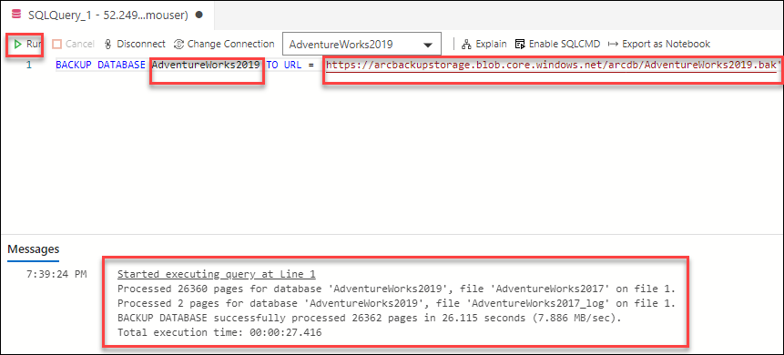

# Exercise 4: Azure Arc enabled SQL Managed Instance

Duration: - 30 mins

In this exercise, you will create a SQL Managed Instance

## Task 1: Create SQL Managed Instance 

1. In the Azure Arc Data Controller dashboard, click on **+ New Instance**.

1. From the deployment options balde, select **Azure SQL managed instance - Azure Arc**. Accept the Privacy and license terms and click **Select** at the button.

   

1. In the Deploy **Azure SQL managed instance - Azure Arc blade**, enter the following information:

   **Under SQL Connection information**
   
   - **Instance name**: Enter arcsql
   
   - **Username**:  Enter arcsqluser
   
   - **Password**: Enter Password.1!!
   
   **SQL Instance settings**
  
   - **Core Request**: Enter 2
   
   - **Core Limit**: Enter 2.5
   
   - **Memory Request**: Enter 2.5
   
   - **Memory Limit**: Enter 2.5
   
     
     
1. Click the **Deploy** button, this will start the deployment of the  **Azure SQL managed instance - Azure Arc** on the data controller.

1. The deployment of **Azure SQL managed instance - Azure Arc** will take about 10 minutes to complete, in this time you can explore through the commands in the notebook.

1. Once the installation is complete, in **Azure Arc Data Controller dashboard** under Azure Arc Resources you can see the newly created Azure Arc enabled SQL Managed Instance.

## Task 2: Connect to Azure Arc enabled SQL Managed Instance

In this task, you will learn how to connect to your newly created Azure Arc enabled SQL Managed Instance using Data Studio

1. In the **Azure Arc Data Controller dashboard**, under Azure Arc Resources click on your newly created SQL Managed Instance this will open  **SQL managed instance - Azure Arc Data Controller dashboard**.

1. Now in the **SQL managed instance - Azure Arc Data Controller dashboard**, copy the external endpoint value. 

1. In the Data studio page, in connections blade under servers click on **New Connection**.

   

1. Enter the following in the connection details page and click on **Connect**.

   - **Connection type** : Select Microsoft SQL Server
   
   - **Sever** : Paste the external end point value which you copied earlier
   
   - **Authentication type** : Select SQL Login
   
   - **User name** : Enter arcsqluser
   
   - **Password** : Enter Password.1!!
   
     
   
1. Now under servers you can see that you are successfully connected with your Azure Arc enabled SQL MI Server.

## Task 3: Configure Azure Arc enabled SQL Managed Instance

In this task you will learn to edit the configuration of Azure Arc enabled SQL Managed Instances with the Azure Data CLI

1. In the Command Prompt, run the following command to see configuration options of SQL Managed Instance.

   ```BASH
   azdata arc sql mi edit --help
   ```
   
1. Run the following command to set the cpu core and memory requests and limit. 

   >**Note** : Make sure to replace <NAME_OF_SQL_MI> with your SQL Managed Instance name.

   ```BASH
   azdata arc sql mi edit --cores-limit 4 --cores-request 2 --memory-limit 4Gi --memory-request 2Gi -n <NAME_OF_SQL_MI>
   ```      

1. Now to run the below command to view the changes that you made to the SQL Managed Instance.

   >**Note** : Make sure to replace <NAME_OF_SQL_MI> with your SQL Managed Instance name.
   
   ```BASH
   azdata arc sql mi show -n <NAME_OF_SQL_MI>
   ```

## Task 4: Restore the AdventureWorks sample database into SQL Managed Instance - Azure Arc

In this task you will download the sample backup file i.e AdventureWorks backup (.bak) into your SQL Managed Instance container and then restore the AdventureWorks database.

1. On your LabVM launch a **Command Prompt** window (Select search on the task bar, type cmd, and select Enter).

1. In the Command Prompt, run the following command to get the lis of pods that are running on your data controller. Copy the pod name of SQL MI instance from the output.

   > **Note** : Please make sure to replace the namespace name with your data controller namespace name

   ```BASH
    kubectl get pods -n <your namespace name>
   ```
   
1. In the Command Prompt, run the following command. This will remotely execute a command inside of the SQL Managed Instance container to download the .bak file into the container. 

   >**Note** : Replace the value of the namespace name and pod name with the value you copied in the previous step.

   ```BASH
   kubectl exec <SQL pod name> -n <your namespace name> -c arc-sqlmi -- wget https://github.com/Microsoft/sql-server-samples/releases/download/adventureworks/AdventureWorks2019.bak -O /var/opt/mssql/data/AdventureWorks2019.bak
   ```

1. Now to restore the AdventureWorks database run the following command.

   > **Note** : Ensure to replace the value of the pod name, namespace name and the password before you run it.

   ```BASH
   kubectl exec <SQL pod name> -n <your namespace name> -c arc-sqlmi -- /opt/mssql-tools/bin/sqlcmd -S localhost -U sa -P <password> -Q "RESTORE DATABASE AdventureWorks2019 FROM  DISK = N'/var/opt/mssql/data/AdventureWorks2019.bak' WITH MOVE 'AdventureWorks2017' TO '/var/opt/mssql/data/AdventureWorks2019.mdf', MOVE 'AdventureWorks2017_Log' TO '/var/opt/mssql/data/AdventureWorks2019_Log.ldf'"
   ```

1. Now switch back to Azure Data Studio, right click on the SQLMI Server and click on refresh, then expand your SQL MI server, expand Databases and verify that AdventureWorks2019 DB is listed.

## Task 5: Migrate: Migrate and Restore SQL Server DB to Azure Arc enabled SQL Managed Instance from Blob storage and Azure arc pod.

 **Method 1: Use Azure blob storage** 
 
 **Step 1: Migrate: SQL Server to Azure Arc enabled SQL Managed Instance**

1. Login to Azure Portal and goto your lab environment RG, you will be able to find Azure blob storage name as acrblobstorageSUFFIX, open that and click on the Access keys button from the left side menu. now click on Show keys button to get the keys.

   

2. Now you will be able to see the storage account name and storage account keys. Copy the storage account name and key1 from the portal and save in a notepad. we will use these values in later steps.

3. Launch Azure data studio and connect to your SQL server, Enter Arc-Data-Client under server name and select authentication as windows and click on connect, After connecting Expand the databases folder and right click on **AdventureWorks2019** Database and select **New Query**.

   

4. Prepare your query in the following format replacing the placeholders indicated by the <...> using the information from the Storage account name and access key in earlier steps. Once you have substituted the values, run the query. Once you see that the Command executed successfully go to next step.

   ```
   IF NOT EXISTS  
           (SELECT * FROM sys.credentials
           WHERE name = 'storagecred')  
          CREATE CREDENTIAL [storagecred]
          WITH IDENTITY = '<Storage Account Name>',  
          SECRET = '<Access key1>';
         ```
          
          
    

5. Similarly, prepare the BACKUP DATABASE command as follows to create a backup file to the blob container. Once you have substituted the values, run the query. Make sure you replace the values of **Database name**, **Storage account name**, **Container name** and **File name**.
Once you see that the Command executed successfully go to next step.

    ``` 
    BACKUP DATABASE <database name> TO URL = 'https://<mystorageaccountname>.blob.core.windows.net/<mystorageaccountcontainername>/<filename>.bak'
    ```
   
   
   

6. Open Azure portal and validate that the backup file created in previous step is visible in the Blob container.


**Step 2: Restore the database from Azure blob storage to SQL Managed Instance - Azure Arc**

1. From Azure Data Studio, login and connect to the SQL Managed Instance - Azure Arc.

1. Expand the System Databases, right-click on master database and select New Query.

1. In the query editor window, prepare and run the same query from previous step to create the credentials.

    ```
           IF NOT EXISTS  
           (SELECT * FROM sys.credentials
           WHERE name = 'storagecred')  
          CREATE CREDENTIAL [storagecred]
          WITH IDENTITY = '<Storage Account Name>',  
          SECRET = '<Access key1>';
     ```
         
1. Prepare and run the below command to verify the backup file is readable, and intact. Make a note of Logical names from the output windows.


    ```
    BACKUP DATABASE AdventureWorks2019 TO URL = 'https://<Sttorage account name>.blob.core.windows.net/<Container name>/<File Name>.bak'
    ```
    
1. Prepare and run the RESTORE DATABASE command as follows to restore the backup file to a database on SQL Managed Instance - Azure Arc.
    Make sure you update the test and test_log value to the logical values from the previous step.    

    ```
    RESTORE DATABASE <database name> FROM URL = 'https://<mystorageaccountname>.blob.core.windows.net/<mystorageaccountcontainername>/<file name>'
    WITH MOVE 'Test' to '/var/opt/mssql/data/<file name>.mdf'
   ,MOVE 'Test_log' to '/var/opt/mssql/data/<file name>.ldf'
    ,RECOVERY  
    ,REPLACE  
    ,STATS = 5;  
   GO
    ```
    
 **Method 2: Copy the backup file into an Azure SQL Managed Instance - Azure Arc pod using kubectl**
   This method shows you how to take a backup file that you create via any method and then copy it into local storage in the Azure SQL managed instance pod so you can restore from there much like you would on a typical file system on Windows or Linux. In this scenario, you will be using the command kubectl cp to copy the file from one place into the pod's file system.
   1. Connect to the SQLMI using azure data studio and right click on the database and click on new query and paste the below query.
      ```
      BACKUP DATABASE Test
      TO DISK = 'c:\tmp\<DB name>.bak'
      WITH FORMAT, MEDIANAME = 'Test’ ;
      GO
      ```
    
   2. Open CMD and run the below command to get the SQLMI pod name.
      ```
      kubectl get pods -n <namespace of data controller>
      ```
   3. Copy the backup file from the local storage to the sql pod in the cluster using the below sql query. Make sure you replace the SQLMI pod name and DB name.

     ```
     kubectl cp C:\temp\<DB name>.bak <SQLMI pod name>:var/opt/mssql/data/<DB Name>.bak -n arc
     ```
   4. run the below query to restore the database to the SQL Managed instance - Azure arc
     
     ```
     RESTORE DATABASE test FROM DISK = '/var/opt/mssql/data/<file name>.bak'
     WITH MOVE '<database name>' to '/var/opt/mssql/data/<file name>.mdf'  
     ,MOVE '<database name>' to '/var/opt/mssql/data/<file name>_log.ldf'  
     ,RECOVERY  
     ,REPLACE  
     ,STATS = 5;  
     GO
     ```
   5. Noow you see that the database is created
   
## Task 6: View SQL MI resource in Azure Portal.
   In this step you will upload some metrics, udages and logs to azure portal and view SQLMI Resource in Azure portal.
   
   1. Open CMD and login to Data controller using below command.
      ```
      Azdata login
      ```
   1. Run these below commands to check if the variables is set or not.
       ~~~
       echo %WORKSPACE_ID%
       echo %WORKSPACE_SHARED_KEY%
       echo %SPN_TENANT_ID%
       echo %SPN_CLIENT_ID%
       echo %SPN_CLIENT_SECRET%
       echo %SPN_AUTHORITY%
       ```
   1. If the varialbles is not created, create now using below commands.
         ```
          SET WORKSPACE_ID=<customerId>
          SET WORKSPACE_SHARED_KEY=<primarySharedKey>
          SET SPN_CLIENT_ID=<appId>
          SET SPN_CLIENT_SECRET=<password>
          SET SPN_TENANT_ID=<tenant>
          SET SPN_AUTHORITY=https://login.microsoftonline.com
         ```
   1. Export all logs to the specified file:

   ```BASH
   azdata arc dc export --type logs --path logs.json
   ```
   1. Upload logs to an Azure monitor log analytics workspace:

   ```BASH
   azdata arc dc upload --path logs.json
   ```
   1. After you will see some outputsto uploaded to Azure.
      
    
   1. Now open azure portal and search for **SQL Mnanged instances - azure arc**  and select the resorce.
      
      
   1. Now you will see some basic information about the Azure Arc enables SQL MI. 

## Task 7: Monitor with Azure Data Studio
