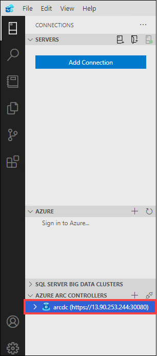
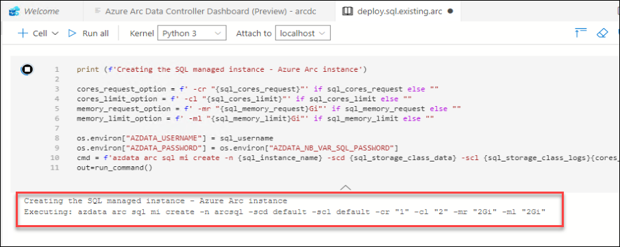
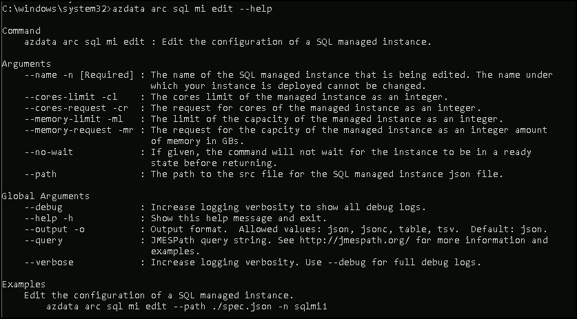
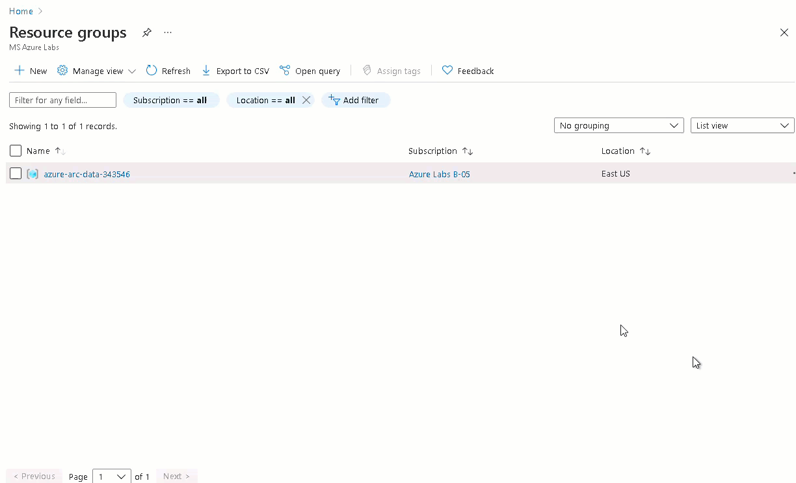
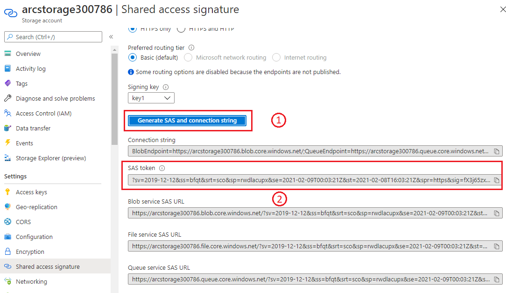

# Exercise 2: Azure Arc-enabled SQL Managed Instance with Disconnected Mode

Duration: 40 mins

Contoso has some applications that use SQL Server as the backend database. They have installed SQL Server on their Windows servers in their manufacturing plants but these locations don’t necessarily have local IT support to update the operating system and SQL Server with the latest security updates. They have explored Azure Database for SQL Server and found that it meets their requirements and offers some unique capabilities such as easy to manage and migrate from different cloud platforms. Therefore they are excited about the opportunity of deploying SQL Server in their Azure Arc-enabled environment with the disconnected mode. Also they can use the resource without even connecting to Azure portal.

In this exercise, let's create an **Azure SQL Managed Instance - Azure Arc** with disconnected and restore and migrate the database using multiple methods. 

Also, we will be exploring the Kibana and Grafana Dashboards and upload the logs and metrics to the Azure portal and view the logs.

## Task 1: Connect to the Pre-deployed Disconnected mode Azure Arc data controller using Azure Data Studio/ Azure Data CLI.

Now let us connect to the data controller using Azure Data Studio and Azure Data CLI

In the environment provided, the Azure Arc Data controller is already deployed on to the Kubernetes Cluster. We are using **indirect** connectivity mode for the Azure Arc-enabled data services environment to Azure.
  
   > ***Info***: There are multiple modes available to connect to Azure. if the Azure Arc enabled data services are directly connected to Azure, then users can use Azure Resource Manager APIs, the Azure CLI, and the Azure portal to operate the Azure Arc data services. we have used the directly connected mode in the previous exercise and its much like how you would use any other Azure service with provisioning/de-provisioning, scaling, configuring, and so on all in the Azure portal.
   
   If you want to know more about this, refer to the [Connectivity Modes](https://docs.microsoft.com/en-us/azure/azure-arc/data/connectivity)

   First let us see how to connect to the data controller using Azure Data CLI.

1. On your JumpVM, open a **Command Prompt** window from the desktop shortcut if not already opened.

1. Run the following command in the command prompt window.

   ```BASH
   azdata login
   ```
   
   
   
1. When prompted to enter the Namespace, copy the value of Disconnected Arc DC Name from the Environment details page and paste it in the command prompt. After executing the command, copy the data controller service API endpoint URL value from the output to a **Notepad**.

   
   
   
   
1. Now you are logged in to the Azure Arc data controller. You can minimize the command prompt window.

1. Next, let us see how to connect to Azure Arc Data controller using Azure data studio.

1. On your JumpVM, open **Azure Data studio** from the desktop shortcut and select **Connections**.

   
   
1. In the **Connections** panel under **Azure Arc Controllers**, click on **Connect Controller**.

1. In the **Connect to Controller** page, provide the following details and click on **Connect**.

   - **Controller URL**: Enter the Azure Arc data controller service API endpoint URL value which you copied to **Notepad** earlier 
   
   - **Name** : Enter arcdc
     ```BASH
     arcdc
     ```
   
   - **Username** : Enter arcuser
     ```BASH
     arcuser
     ```
   
   - **Password** : Enter Password.1!!
     ```BASH
     Password.1!!
     ```
   
   - Select the Remember Password checkbox
   
     
    
1. Once the connection is successful, you can see the Azure Arc data controller listed under Azure Arc Controllers on the bottom left of the Azure Data Studio.

    


## Task 2: Create Azure Arc-enabled SQL Managed Instance 

In this task, let's learn how to create Azure Arc-enabled Azure SQL Managed Instance using Azure Arc Data controller.

> Note: please note that we have already deployed the Azure Arc data controller for you in the lab with the help of Azure CLI

1. Open **Azure Data Studio** from the desktop if not already opened. 
   Note: Azure Data Studio is a free cross-platform database tool for data professionals using on-premises and cloud data platforms on Windows, macOS, and Linux

1. Now right click on the Azure Arc data controller connection, click on Manage, and then click on the **+ New Instance** button within the Azure Arc Data controller dashboard. 

   
  
1. Now, select the **Azure SQL Managed Instance - Azure Arc (preview)** and click on **Select** at the bottom of the page.

   
   
1. In the next page that opens up, select the **Checkbox** to accept the Microsoft Privacy statement and then click on **Next button** to proceed with the deployment. You can click on the privacy statement link to view the terms and conditions if you want to read through it.

   > **Note**: You will also see a **Required tools** table under the terms and conditions line. These tools are required to deploy the Azure Arc-enabled Azure SQL Managed Instance. You don't have to worry about installation of any of those tools because we have already installed these required tools for you.

   

1. In the deploy **Azure SQL Managed Instance - Azure Arc blade**, enter the following information:

   **Under SQL Connection information**
   
   - **Instance name**: Enter arcsql
     ```BASH
     arcsql
     ```
   
   - **Username**:  Enter arcsqluser
     ```BASH
     arcsqluser
     ```
   
   - **Password**: Enter Password.1!!
     ```BASH
     Password.1!!
     ```
   
   **SQL Instance settings**
  
   - **Core Request**: Enter 1
     ```BASH
     1
     ```
   
   - **Core Limit**: Enter 2
     ```BASH
     2
     ```
   
   - **Memory Request**: Enter 2
     ```BASH
     2
     ```
   
   - **Memory Limit**: Enter 2
     ```BASH
     2
     ```
   
1. Click the **Deploy** button, this will start the deployment of the  **Azure SQL Managed instance - Azure Arc** on the data controller.

   
     
1. After clicking on the deployment button, a Notebook will open up and the cell execution will start automatically to deploy the **SQL Managed Instance**.

   

1. The deployment of **Azure SQL Managed instance - Azure Arc** will take around 5-10 minutes to complete, in this time you can explore through the commands in the notebook.

1. Once the deployment is complete, you will see the text **arcsql is Ready** at the bottom of the notebook as shown in the screenshot. 

   

1. Once the installation is complete, in **Azure Arc Data Controller dashboard** under Azure Arc Resources you can see the newly created Azure Arc-enabled Azure SQL Managed instance.

   

   > **Note**: You might have to right-click and refresh on Arc data controller to view the instance if you don't see one after seeing the text **arcsql is Ready** at the bottom of the notebook.

## Task 3: Connect to Azure Arc-enabled Azure SQL Managed Instance using Azure Data Studio.

In this task, let us learn how to connect to your newly created Azure Arc-enabled Azure SQL Managed instance using Azure Data Studio.

1. In the **Azure Arc Data Controller dashboard**, under Azure Arc Resources right-click on your newly created Azure SQL Managed instance and select manage, this will open  **Azure SQL Managed instance - Azure Arc Data Controller dashboard**.

1. Now in the **Azure SQL Managed instance - Azure Arc Data Controller dashboard**, copy the **IP Address** from under external endpoint. You can also see that the status is **Ready**.

   

1. In the Azure Data Studio page, in connections blade under servers click on **New Connection**.

   

1. Enter the following in the connection details page and click on **Connect**.

   - **Connection type** : Select **Microsoft SQL Server**.
   
   - **Sever**: Paste the external endpoint value which you copied earlier

   >**Note**: Make sure you have entered **IP Address** only and remove **port number**.
   
   - **Authentication type** : Select **SQL Login** from the drop down options
   
   - **User name** : Enter arcsqluser
     ```BASH
     arcsqluser
     ```
   
   - **Password** : Enter Password.1!!
     ```BASH
     Password.1!!
     ```
   
   
   
1. Now you can see that you are successfully connected with your Azure Arc-enabled SQL MI Server. Under servers you can see that you are successfully connected with your Azure Arc-enabled SQL MI Server. You can explore the SQLMI dashboard to view the databases and run a query.

   

## Task 3: Configure Azure Arc-enabled Azure SQL Managed Instance

In this task, let's learn to edit the configuration of Azure Arc-enabled Azure SQL Managed instances with Azure Data CLI.

1. Open Command Prompt from the desktop shortcut and run the following command to see configuration options of Azure SQL Managed instance.

   ```BASH
   azdata arc sql mi edit --help
   ```

   

1. Now run the following command to set the custom CPU core and memory requests and limit. 

   >**Note**: Make sure to replace <NAME_OF_SQL_MI> with your Azure SQL Managed instance name which will be **arcsql** if you also provided the same for Instance name during creation of Azure SQL Managed Instance. Also, you shouldn't select the Core and memory limit more than the given limits.

   ```BASH
   azdata arc sql mi edit --cores-limit 3 --cores-request 2 --memory-limit 2Gi --memory-request 2Gi -n <NAME_OF_SQL_MI>
   ```      

   

1. Now, you can run the below command to view the changes that you made to the Azure SQL Managed instance.

   >**Note**: Make sure to replace <NAME_OF_SQL_MI> with your Azure SQL Managed instance name which will be **arcsql** if you also provided the same for Instance name during creation of Azure SQL Managed Instance.
   
   ```BASH
   azdata arc sql mi show -n <NAME_OF_SQL_MI>
   ```

   

## Task 4: Restore the AdventureWorks sample database into Azure SQL Managed instance - Azure Arc Using Kubectl.

Migrating an existing SQL database from a SQL Server to Azure Arc-enabled SQL MI is very simple. All you have to do is to take a backup from your existing SQL Server, and then restore that backup to SQL MI.

Now let's restore the sample backup file i.e AdventureWorks backup (.bak) into your Azure SQL Managed instance container using Kubectl commands.

1. Launch a **Command Prompt** window from the desktop of your JumpVM if you have already closed the existing one.

1. In the Command Prompt, run the following command to get the list of pods that are running on your data controller. 

   > **Note**: Please make sure to replace the namespace name with your data controller namespace name which will be **arcdc**.

   ```BASH
   kubectl get pods -n <your namespace name>
   ```
   
1. From the output of the above command, copy the pod name of the SQL MI instance from the output which will be in following format sqlinstancename-0. If you followed the same naming convention as in the instructions, the pod name will be **arcsql-0**.

   > **Note**: Please copy the Pod Name for the next step.

   
   
1. In the Command Prompt, run the following command after replacing the required values. This will remotely execute a command in the Azure SQL Managed instance container to download the .bak file onto the container.

   >**Note**: Replace the value of the namespace name and pod name with the value you copied in the previous step.

   ```BASH
   kubectl exec <SQL pod name> -n <your namespace name> -c arc-sqlmi -- wget https://github.com/Microsoft/sql-server-samples/releases/download/adventureworks/AdventureWorks2019.bak -O /var/opt/mssql/data/AdventureWorks2019.bak
   ```

   

1. Now, to restore the AdventureWorks database, you can run the following command.

   > **Note**: Ensure to replace the value of the pod and the namespace name before you run it. Rest of the values we have already added in the command, you can go through the command and figure out what all are being passed as arguements.

   ```BASH
   kubectl exec <SQL pod name> -n <your namespace name> -c arc-sqlmi -- /opt/mssql-tools/bin/sqlcmd -S localhost -U arcsqluser -P Password.1!! -Q "RESTORE DATABASE AdventureWorks2019 FROM  DISK = N'/var/opt/mssql/data/AdventureWorks2019.bak' WITH MOVE 'AdventureWorks2017' TO '/var/opt/mssql/data/AdventureWorks2019.mdf', MOVE 'AdventureWorks2017_Log' TO '/var/opt/mssql/data/AdventureWorks2019_Log.ldf'"
   ```

   

1. Now you can switch back to Azure Data Studio, and then right-click on the SQL MI Server under CONNECTIONS on the top left of the Azure Data Studio and click on refresh

1. Then, expand your SQL MI server if not already by clicking on the arrow icon on the left of the IP Address, then expand Databases and verify that AdventureWorks2019 Database is listed there.

   

## Task 5: Migrate and Restore SQL Server DB to Azure Arc-enabled Azure SQL Managed instance from Blob storage and Azure arc pod.

Now that we have the Azure SQL Managed instance ready, let's migrate and restore the SQL server database to the Azure Arc-enabled SQLMI. 
   
There are two methods to do the migration and restore - One is by using the Azure blob storage to back up and restore DB to SQLMI, and the Second one is by using the kubectl commands. 

 **Method 1: Using Azure blob storage** 
 
 **Step 1: Migrate: SQL Server to Azure Arc-enabled Azure SQL Managed instance**

1. Navigate to Azure portal - https://portal.azure.com and login if you haven't already.

1. From the home page, select Resource groups under Navigate.

   

1. From the next page, open the resource group you have access to. You will be able to find a resource of type Azure blob storage with name as arcstorageUNIQUEID. Click on that resource. 

   

1. You will be directed to the overview blade of the resource. Then, click on the **Shared access signature** from the left side bar. Now click on the **Generate SAS and connection string** button to get the keys.

   > **Note**: Before generating SAS token make sure all the three check boxes(Service, Container, Object) under **Allow resource types** are checked.

   
   
   > **Info**: **Shared Access Signature** makes sure that the database backups are only available for authorized users. Since we are talking about security, could be a good idea to also say that backups can also be encrypted if needed.

   

1. Now you will be able to see the storage account name at the top and Shared access signature token. Copy the Storage account name and SAS token from the portal and save it in a **notepad** for later usage. Then, click on Overview from the left tab and then select **Containers** and copy the container name onto the notepad for later use.

   

   > **Note**: After copying SAS token to notepad remove **?** at the beginning of the token before useing it later.

   

1. Launch Azure Data Studio and double click on the **localhost** to connect with the local server. After connecting, click on the databases folder and right-click on **AdventureWorks2019** Database, and select **New Query**.

   

1. Prepare your query in the following format replacing the placeholders indicated by the <...> using the information from the Storage account name and SAS token in earlier steps. 

   Once you have substituted the values, run the query. 

   ```BASH
   CREATE CREDENTIAL [https://<storage-account-name>.blob.core.windows.net/<storage-container-name>] WITH IDENTITY = 'Shared Access Signature' 
   ,SECRET = '< replace with sas token >'
   ```

   Once you see that the Command is executed successfully go to the next step.
          
   

1. Similarly, prepare the BACKUP DATABASE command as follows to create a backup file to the blob container. 

   Once you have substituted the values, run the query. Make sure you replace the values of **Database name**, **Storage account name**, **Container name**, and **Filename**.

   ``` 
   BACKUP DATABASE <database name> TO URL = 'https://<mystorageaccountname>.blob.core.windows.net/<mystorageaccountcontainername>/<filename>.bak'; 
   ```

   Once you see that the command is executed successfully, you can go to the next step.

   
   
1. Open the Azure portal and validate that the backup file created in the previous step is visible in the Blob container. For this, you have to go to the storage account and click on the container button and then open the arccontainer to view the backup file.
  
   

**Step 2: Restore the database from Azure blob storage to Azure SQL Managed instance - Azure Arc**

1. Navigate back to Azure Data Studio, login and connect to the Azure SQL Managed instance - Azure Arc if not already .

1. Expand the System Databases, right-click on the master database, and select New Query.

1. In the query editor window, prepare and run the below query by replacing with the required values to create the credentials.

   ```
   CREATE CREDENTIAL [https://<storage-account-name>.blob.core.windows.net/<storage-container-name>] WITH IDENTITY = 'Shared Access Signature' 
   ,SECRET = '< SAS >'
   ```
 
1. Prepare and run the below command to verify the backup file is readable and intact. Make a note of logical names from the output windows.

   ```
   RESTORE FILELISTONLY FROM URL = 'https://<Storage account name>.blob.core.windows.net/<Container name>/<File Name>.bak'
   ```

1. Prepare and run the RESTORE DATABASE command as follows to restore the backup file to a database on Azure SQL Managed instance - Azure Arc. Make sure you update the test and test_log value to the logical values from the previous step.    

   ```
   RESTORE DATABASE <database name> FROM URL = 'https://<mystorageaccountname>.blob.core.windows.net/<mystorageaccountcontainername>/<file name>'
   WITH MOVE '<file name>' to '/var/opt/mssql/data/<file name>.mdf'
   ,MOVE '<file name>_log' to '/var/opt/mssql/data/<file name>.ldf'
   ,RECOVERY  
   ,REPLACE  
   ,STATS = 5;  
   GO
   ```
   
   
    
**Method 2: Copy the backup file into an Azure SQL Managed instance - Azure Arc pod using kubectl**
   
This method shows you how to take a backup file that you create via any method and then copy it into local storage in the Azure SQL Managed instance pod.
   
So you can restore from there much like you would on a typical file system on Windows or Linux.
   
In this scenario, you will be using the command kubectl cp to copy the file from one place into the pod's file system.
   
1. Connect to the SQL MI using Azure Data Studio and right-click on the database and click on the new query and paste the below query.
   
   ```
   BACKUP DATABASE AdventureWorks2019
   TO DISK = 'c:\tmp\<DB name>.bak'
   WITH FORMAT, MEDIANAME = 'AdventureWorks2019’ ;
   GO
   ```
    
2. Open CMD and run the below command to get the SQLMI pod name.
   
   ```
   kubectl get pods -n <namespace of data controller>
   ```

3. Copy the backup file from the local storage to the SQL pod in the cluster using the below SQL query. Make sure you replace the SQLMI pod name and DB name.
   
   ```
   kubectl cp C:\temp\<DB name>.bak <SQLMI pod name>:var/opt/mssql/data/<DB Name>.bak -n arc
   ```

4. Run the below query to restore the database to the Azure SQL Managed instance - Azure arc
     
   ```
   RESTORE DATABASE test FROM DISK = '/var/opt/mssql/data/<file name>.bak'
   WITH MOVE '<database name>' to '/var/opt/mssql/data/<file name>.mdf'  
   ,MOVE '<database name>' to '/var/opt/mssql/data/<file name>_log.ldf'  
   ,RECOVERY  
   ,REPLACE  
   ,STATS = 5;  
   GO
   ```

5. Now you can see that the database is created.
   
## Task 6: View SQL MI resource and SQL Mi logs in Azure portal.
   
Now that we have the database created, let us upload some metrics, usages, and logs to the Azure Portal and view SQLMI Resource in the Azure portal.
   
1. Navigate back to the command prompt window. Login to the Azure Arc Data controller using the below command if you are not already logged in.
   
   ```
   azdata login
   ```

1. Run these below commands to check if the variables are set or not.
   
   ```BASH
   echo %WORKSPACE_ID%
   ```

   ```BASH
   echo %WORKSPACE_SHARED_KEY%
   ```

   ```BASH
   echo %SPN_TENANT_ID%
   ```

   ```BASH
   echo %SPN_CLIENT_ID%
   ```

   ```BASH
   echo %SPN_CLIENT_SECRET%
   ```

   ```BASH
   echo %SPN_AUTHORITY%
   ```
       
1. If the variables are not defined, set it now using the below commands.
   
   ```
   SET WORKSPACE_ID=<customerId>
   ```

   ```
   SET WORKSPACE_SHARED_KEY=<primarySharedKey>
   ```

   ```
   SET SPN_CLIENT_ID=<appId>
   ```

   ```   
   SET SPN_CLIENT_SECRET=<password>
   ```

   ```
   SET SPN_TENANT_ID=<tenant>
   ```

   ```
   SET SPN_AUTHORITY=https://login.microsoftonline.com
   ```

   > **Note**: You can get the workspace ID and key from the Azure portal and service principal details from the Environment Details tab at the top and then navigating to Service Principal details.

1. Export all logs to the specified file:
   
   ```
   azdata arc dc export --type logs --path logs.json
   ```

1. Upload logs to an Azure monitor log analytics workspace:
      
   > **Note**: We have already deployed the log analytics workspace in the previous exercise.
   
   ```
   azdata arc dc upload --path logs.json
   ```
      
1. After some time, you will see some outputs uploaded to Azure.

   
    
1. Now open the Azure portal and search for **Azure SQL Managed instances - azure arc**  and select the resource.

   
      
1. Now you will see some basic information about the Azure Arc-enabled SQL MI.
      
   
   
1. Now to view your logs in the Azure portal, open the Azure portal and then search for your log analytics workspace by name in the search bar at the top and then select it.

1. In the **Log Analytics workspaces** page, select your workspace.
   
   

1. Now in your log analytics workspace page, from the left navigation menu under **General** select **Logs** and one page will open, on the age click on close button.
     
   

1. In the logs page, expand Custom Logs at the bottom of the list of tables and you will see a table called **sqlManagedInstances_lo**.
   
   

1. Select the **eye** icon next to the table name and select the **View in the query editor** button.
   
   

1. Now you will have a query in the query editor that will show the most recent 10 events in the log. 
   
   

## Task 7: Monitor with Azure Data Studio

Now let us Monitor the SQL MI status using Grafana and Kibana.
  
1. Open Azure Data studio on the JumpVM provided and right-click on the SQL MI resource under the Azure Arc controller and click on manage.
  
1. Now copy the endpoint for Kibana dashboard and browser this endpoint in a browser.
  
1. Enter below user name and password for SQLMI.
  
   > **Note** You have to enter the credentials of Azure Arc data controller.
  
   - **User name** : arcuser
     ```BASH
     arcuser
     ```

   - **Password** : Password.1!!
     ```BASH
     Password.1!!
     ```

   
   
   

1. You can explore the page for kibana. 
  
   > ***Info***: You can learn more about kibana here: [View logs and metrics using Kibana and Grafana](https://docs.microsoft.com/en-us/azure/azure-arc/data/monitor-grafana-kibana)
    
## View the Visualization and metric using grafana graph
  
1. Now go back to the Azure Data Studio which you had opened earlier on the provided JumpVM on the left.
  
1. Now copy the endpoint for the Grafana dashboard and browser this endpoint in a browser.
  
1. Enter below user name and password for SQLMI.
  
   > **Note** You have to enter the credentials of the Azure Arc data controller.
      
   - **User name** : arcuser
     ```BASH
     arcuser
     ```

   - **Password** : Password.1!!
     ```BASH
     Password.1!!
     ```

   
   
1. You can explore the page for Grafana. 
  
   > ***Info***:  You can learn more about Grafana here: [View logs and metrics using Kibana and Grafana](https://docs.microsoft.com/en-us/azure/azure-arc/data/monitor-grafana-kibana)  
  

## After this exercise, you have performed the following

   - Created Azure SQL Managed instance.
   - Connected to Azure Arc-enabled Azure SQL Managed instance.
   - Configured Azure Arc-enabled SQL Managed Instance.
   - Restored the AdventureWorks sample database into Azure SQL Managed instance - Azure Arc.
   - Migrated and Restored SQL Server DB to Azure Arc-enabled Azure SQL Managed instance from Blob storage and Azure arc pod.
   - Viewed SQL MI resources and logs in Azure portal.
   - Monitored with kibana and grafana.
{"mode":"full","isActive":false}
