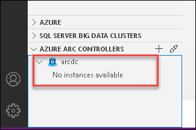
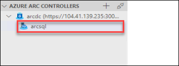
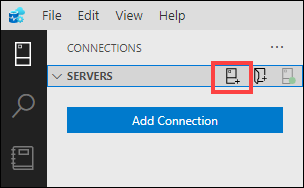
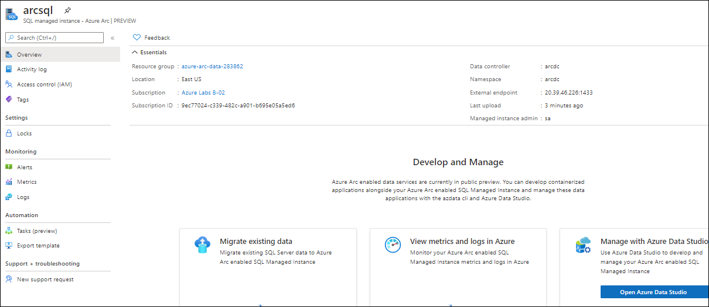
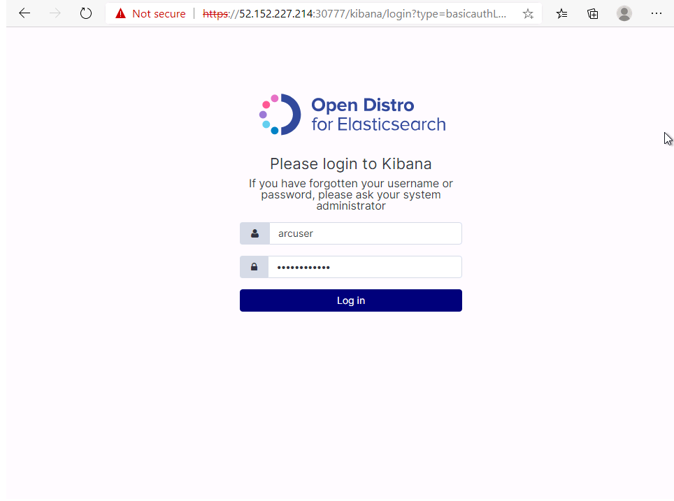

# Exercise 2: Azure Arc-enabled SQL Managed Instance with Disconnected Mode

Duration: 40 mins

Contoso has some applications that use SQL Server as the backend database. They have installed SQL Server on their Windows servers in their manufacturing plants. These locations don't necessarily have local IT support to update the operating system and SQL Server with the latest security updates. They have explored Azure SQL Managed Instance and found that it would meet their requirements. However, their manufacturing plants are not directly connected to the internet and they also need to keep the databases close to their applications at the factory floor. 

Therefore, they are excited about the opportunity of deploying Azure SQL Managed Instance in their local Azure Arc-enabled environment using the indirectly connected mode of Azure Arc data controller. 


In this exercise, we are creating an Azure SQL Managed Instance in a local Azure Arc-enabled Kubernetes cluster using indirectly connected mode. We also restore and migrate a database from a backup taken on a SQL Server. 

Also, we will be exploring the Kibana and Grafana dashboards, and uploading the telemetry data such as logs and metrics data to Azure where they are available for viewing. 

## Task 1: Connect to an existing Azure Arc data controller deployed in indirectly connected mode using Azure Data Studio.

Now let us connect to the data controller using Azure Data Studio.

In the environment provided, Azure Arc data controller has already been deployed on to the Azure Arc-enabled Kubernetes cluster in indirectly connected mode. 
  
   > ***Info***: Azure Arc data controller can be configured in directly and indirectly connected mode. The connectivity mode provides you the flexibility to choose how much data is sent to Azure and how users interact with the Azure Arc data controller. Depending on the connectivity mode that is chosen, some functionality of Azure Arc-enabled data services may or may not be available. We used the directly connected mode in the previous exercise and explored the experience which is much like how you would use any other Azure service with provisioning/de-provisioning, scaling, configuring, and so on all in the Azure portal. 
   
   If you want to know more about this, refer to the [Connectivity Modes](https://docs.microsoft.com/en-us/azure/azure-Arc/data/connectivity)


1. On your JumpVM, open **Azure Data Studio** from the desktop shortcut and select **Connections**.

   
   
1. In the **Connections** panel under **Azure Arc Controllers**, click on **Connect Controller**.

1. In the **Connect to Controller** page, provide the following details.

   - **Namespace**:
     ```BASH
     arcdc
     ```
     
   - **Name** : Enter arcdc
     ```BASH
     arcdc
     ```
   
     

1. Now, click on **Connect**.
    
1. Once the connection is successful, you can see the Azure Arc data controller listed under Azure Arc Controllers on the bottom left of the Azure Data Studio.

    


## Task 2: Create Azure Arc-enabled SQL Managed Instance 

In this task, let's learn how to create Azure Arc-enabled SQL Managed Instance using Azure Arc data controller in indirectly connected mode. 


1. Open **Azure Data Studio** from the desktop if not already opened. 
   Note: Azure Data Studio is a free cross-platform database tool for data professionals using on-premises and cloud data platforms on Windows, macOS, and Linux

1. Now right click on the Azure Arc data controller connection, click on Manage, and then click on the **+ New Instance** button within the Azure Arc Data controller dashboard. 

   
  
1. Now, select the **Azure SQL Managed Instance - Azure Arc (preview)** and click on **Select** at the bottom of the page.

   
   
1. In the next page that opens up, select the **Checkbox** to accept the Microsoft Privacy statement and then click on **Next button** to proceed with the deployment. You can click on the privacy statement link to view the terms and conditions if you want to read through it.

   > **Note**: You will also see a **Required tools** table under the terms and conditions line. These tools are required to deploy the Azure Arc-enabled SQL Managed Instance. You don't have to worry about installation of any of those tools because we have already installed these required tools for you.

   

1. In the deploy **Azure SQL Managed Instance - Azure Arc blade**, enter the following information:

   **Under SQL Connection information**
   
   - **Instance name**: Enter arcsql
     ```BASH
     arcsql
     ```
   
   - **Username**:  Enter arcsqluser
     ```BASH
     arcsqluser
     ```
   
   - **Password**: Enter Password.1!!
     ```BASH
     Password.1!!
     ```
   
   **SQL Instance settings**
  
   - **Core Request**: Enter 1
     ```BASH
     1
     ```
   
   - **Core Limit**: Enter 2
     ```BASH
     2
     ```
   
   - **Memory Request**: Enter 2
     ```BASH
     2
     ```
   
   - **Memory Limit**: Enter 2
     ```BASH
     2
     ```
   
1. Click the **Deploy** button, this will start the deployment of the  **Azure Arc-enabled SQL Managed Instance** on the data controller.

   
     
1. After clicking on the deployment button, a Notebook will open, and the cell execution will start automatically to deploy the **SQL Managed Instance**.

   

1. The deployment of **Azure Arc-enabled SQL Managed Instance** will take around 5-10 minutes to complete, in this time you can explore through the commands in the notebook.

1. Once the deployment is complete, you will see the text **arcsql is Ready** at the bottom of the notebook as shown in the screenshot. 

   

1. Once the installation is complete, in **Azure Arc data controller dashboard** under Azure Arc Resources you can see the newly created Azure Arc-enabled SQL Managed Instance.

   

   > **Note**: You might have to right-click and refresh on Arc data controller to view the instance if you don't see one after seeing the text **arcsql is Ready** at the bottom of the notebook.

## Task 3: Connect to Azure Arc-enabled SQL Managed Instance using Azure Data Studio.

In this task, let us learn how to connect to your newly created Azure Arc-enabled SQL Managed Instance using Azure Data Studio.

1. In the **Azure Arc data controller dashboard**, under Azure Arc Resources right-click on your newly created Azure SQL Managed instance and select manage, this will open **Azure SQL Managed instance - Azure Arc Data Controller dashboard**.

1. Now in the **Azure Arc-enabled SQL Managed Instance**, copy the **IP Address** from under external endpoint. You can also see that the status is **Ready**.

   

1. In the Azure Data Studio page, in connections blade under servers click on **New Connection**.

   

1. Enter the following in the connection details page and click on **Connect**.

   - **Connection type** : Select **Microsoft SQL Server**.
   
   - **Sever**: Paste the external endpoint value which you copied earlier

     
   - **Authentication type** : Select **SQL Login** from the drop down options
   
   - **User name** : Enter arcsqluser
     ```BASH
     arcsqluser
     ```
   
   - **Password** : Enter Password.1!!
     ```BASH
     Password.1!!
     ```
   
   
   
1. Now you can see that you are successfully connected with your Azure Arc-enabled SQL MI Server under servers. You can explore the SQLMI dashboard to view the databases.

   

## Task 4: Configure Azure Arc-enabled Azure SQL Managed Instance

In this task, Let's learn how to modify the configuration parameters of Azure Arc-enabled SQL Managed Instance using Azure Data CLI.

1. Open Command Prompt from the desktop shortcut and run the following command to see configuration options of Azure SQL Managed instance.

   ```BASH
   az sql mi-arc edit --help
   ```

   

1. Now run the following command to set the custom CPU core and memory requests and limit. 

   >**Note**: Please make sure to not modify the core and memory limits.

   ```BASH
   az sql mi-arc edit --cores-limit 3 --cores-request 2 --memory-limit 2Gi --memory-request 2Gi -n arcsql --k8s-namespace arcdc --use-k8s
   ```      

    

1. Now, you can run the below command to view the changes that you made to the Azure SQL Managed instance.

   >**Note**: Make sure to replace <NAME_OF_SQL_MI> with your Azure SQL Managed instance name which will be **arcsql** if you also provided the same for Instance name during creation of Azure SQL Managed Instance.
   
    ```BASH
    az sql mi-arc show -n arcsql --k8s-namespace arcdc --use-k8s

    ```

   

## Task 4: Restore the AdventureWorks sample database into Azure SQL Managed instance - Azure Arc Using Kubectl.

Restore an existing SQL database from a SQL Server to Azure Arc-enabled SQL MI is very simple. All you have to do is to take a backup from your existing SQL Server, and then restore that backup to SQL MI. 
In our scenario we already have an AdventureWorks backup file copied in one of Kubernetes cluster pod. The backup file was generated from a SQL Server 2019 database server and moved to the Kubernetes cluster.

Now let's restore the sample backup file i.e AdventureWorks backup (.bak) into your Azure SQL Managed instance container using Kubectl commands.

1. Launch a **Command Prompt** window from the desktop of your JumpVM if you have already closed the existing one.

1. In the Command Prompt, run the following command to get the list of pods that are running on your data controller. 
   
   ```BASH
   kubectl get pods -n arcdc
   ```

1. Copy the backup file from the **Cluster pod** to the **SQL pod** in the cluster using the below query. 
   
   ```
   kubectl cp /tmp/AdventureWorks2019.bak arcsql-0:var/opt/mssql/data/adventureworks2019.bak -c arc-sqlmi -n arcdc
   ```

   > ```Note:``` We have already replaced the value of container and pod in the above command. 
   
1. Now, to restore the AdventureWorks database, you can run the following command.

     ```BASH
      kubectl exec arcsql-0 -n arcdc -c arc-sqlmi -- /opt/mssql-tools/bin/sqlcmd -S localhost -U arcsqluser -P Password.1!! -Q "RESTORE DATABASE AdventureWorks2019 FROM  DISK = N'/var/opt/mssql/data/AdventureWorks2019.bak' WITH MOVE 'AdventureWorks2017' TO '/var/opt/mssql/data/AdventureWorks2019.mdf', MOVE 'AdventureWorks2017_Log' TO '/var/opt/mssql/data/AdventureWorks2019_Log.ldf'"
      ```

    

1. Now you can switch back to Azure Data Studio, and then right-click on the SQL MI Server under CONNECTIONS on the top left of the Azure Data Studio and click on refresh

1. Then, expand your SQL MI server if not already by clicking on the arrow icon on the left of the IP Address, then expand Databases and verify that AdventureWorks2019 Database is listed there.

   

1. Now, you have successfully restored the sample database from an existing backup file to your Azure Arc-enabled SQL MI.
   
## Task 6: View SQL MI resource and SQL Mi logs in Azure portal.
   
Now that we have the database created, let us export some metrics, usages, and logs to the system.


> Note: Please note that you can upload these logs from the other machine also where you have connected to Azure. this is only supported in Disconnected mode, and you can use the resources without even connecting to Azure portal.
   
1. Navigate back to the command prompt window.

1. Export all logs to the specified file:
   
   ```
   az arcdata dc export --type logs --path logs.json --k8s-namespace arcdc --use-k8s
   ```
   > **Note**: You may see a message "Bypass server certificate check: (y/n):", then enter `Y` to bypass the certificate check.

1. Upload logs to an Azure monitor log analytics workspace:
      
   > **Note**: We have already deployed the log analytics workspace in the previous exercise.
   
   ```
   azdata Arc dc upload --path logs.json
   ```
      
1. After some time, you will see some outputs uploaded to Azure.

   
    
1. Now open the Azure portal and search for **Azure SQL Managed instances - azure Arc** and select the resource.

   
      
1. Now you will see some basic information about the Azure Arc-enabled SQL MI.
      
   
   
1. Now to view your logs in the Azure portal, open the Azure portal and then search for your log analytics workspace by name in the search bar at the top and then select it.

1. In the **Log Analytics workspaces** page, select your workspace.
   
   

1. Now in your log analytics workspace page, from the left navigation menu under **General** select **Logs** and one page will open, on the age click on close button.
     
   

1. In the logs page, expand Custom Logs at the bottom of the list of tables and you will see a table called **sqlManagedInstances_lo**.
   
   

1. Select the **eye** icon next to the table name and select the **View in the query editor** button.
   
   

1. Now you will have a query in the query editor that will show the most recent 10 events in the log. 
   
   

## Task 7: Monitor with Azure Data Studio

Now let us Monitor the SQL MI status using Grafana and Kibana.
  
1. Open Azure Data studio on the JumpVM provided and right-click on the SQL MI resource under the Azure Arc controller and click on manage.
  
1. Now copy the endpoint for Kibana dashboard and browser this endpoint in a browser.
  
1. Enter below username and password for SQLMI.
  
   > **Note** You have to enter the credentials of Azure Arc data controller.
  
   - **User name** : arcuser
     ```BASH
     arcuser
     ```

   - **Password** : Password.1!!
     ```BASH
     Password.1!!
     ```

   
   
   

1. You can explore the page for kibana. 
  
   > ***Info***: You can learn more about Kibana here: [View logs and metrics using Kibana and Grafana](https://docs.microsoft.com/en-us/azure/azure-Arc/data/monitor-grafana-kibana)
    
## View the Visualization and metric using Grafana graph
  
1. Now go back to the Azure Data Studio which you had opened earlier on the provided JumpVM on the left.
  
1. Now copy the endpoint for the Grafana dashboard and browser this endpoint in a browser.
  
1. Enter below username and password for SQLMI.
  
   > **Note** You have to enter the credentials of the Azure Arc data controller.
      
   - **User name** : arcuser
     ```BASH
     arcuser
     ```

   - **Password** : Password.1!!
     ```BASH
     Password.1!!
     ```

   
   
1. You can explore the page for Grafana. 
  
   > ***Info***:  You can learn more about Grafana here: [View logs and metrics using Kibana and Grafana](https://docs.microsoft.com/en-us/azure/azure-Arc/data/monitor-grafana-kibana)  
  

## After this exercise, you have performed the following

   - Created Azure SQL Managed instance.
   - Connected to Azure Arc-enabled Azure SQL Managed instance.
   - Configured Azure Arc-enabled SQL Managed Instance.
   - Restored the AdventureWorks sample database into Azure SQL Managed instance - Azure Arc.
   - Exported the Azure Arc data controller logs.

