# Deploy Azure Arc Data Controller 
  Duration: 30 Minutes
  
 In this Exercise you will Connect the AKS to Azure Arc Kuberenetes cluster and after you will be deploying Azure Arc Data Controller with direct connected mode and custom location with the help of Azure Portal and Az CLI on top of Azure Arc kubernetes cluster.
 
 
# Exercise 1: Connect Existing Azure Kuberenets Cluset to Azure Arc Kuberenetes cluster.
 
 ## Task 1: Login to Azure and install Azure CLI extensions.
 
1. Open **Windows Powershell** from the desktop of your ARCHOST VM and run the below command to login to Azure.
    ```
    az login
    ```
1. After running the above command a browser tab will open to login to azure portal.
 
1. On the **Sign into Microsoft Azure** tab you will see the login screen, in that enter following **Email/Username** and then click on **Next**. 
   * Email/Username: <inject key="AzureAdUserEmail"></inject>

1. Now enter the following **Password** and click on **Sign in**.
   * Password: <inject key="AzureAdUserPassword"></inject>

1. After adding the creds you will see that you have logged into the Microsoft Azure.

    

1. Now switch back to Windows Powershell and you will be able to see that you have logged in to Azure.

1. Now run the below commands to install required Azure CLI extensions.
   
   ```
   az extension add --name connectedk8s
   az extension add --name k8s-extension
   az extension add --name customlocation  
   
   ```
   
    
1. If you've previously installed the connectedk8s, k8s-extension, and customlocation extensions, update to the latest version using the following command:

   ```
   az extension update --name connectedk8s
   az extension update --name k8s-extension
   az extension update --name customlocation
   ```
   
1. You can validate you have all the required extensions with the latest versions by running the below command: 
   
   ```
   az version
   ```
   
1. After making sure the required tools are installed, next step is to register your subscription with Arc for kubernetes.


1. Run the below command to register the required Resource providers if not already registered. 
   ```
   az provider register --namespace Microsoft.Kubernetes
   az provider register --namespace Microsoft.KubernetesConfiguration
   az provider register --namespace Microsoft.ExtendedLocation
   az provider register --namespace Microsoft.K8sConfiguration
   ```

Task 2: Connect Azure Kubernetes cluster to Azure Arc kuberenets cluster and enable features on top op Azure Arc CLuster.

In this Task you will be Connecting the existing AKS to Azure Arc kubernetes cluster and will be enabling custom features to create the extension and custom location on Azure Arc kubernetes cluster.

1. Run the below command to Connect the existing AKS to Azure Arc kubernetes cluster. Once you run the below command, it will take few minutes to Connect the AKS to Azure Arc.

   ```
   az connectedk8s connect --name Arc-Data-Demo --resource-group azure-arc
   
   ```
  
   > **Note:** We hav already defined  your Cluster name and Azure resouce group name in the above commands, If you are trying this in your subscription please make sure that you have entered correct details.
   
 1. Once the previous command is executed successfully, the provisioning state in output will show as succeeded.

     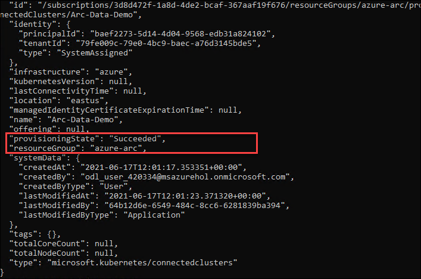

 1. Verify whether the Azure Arc Kubernets cluster is connected by running the following command:

    ```
    az connectedk8s list -g azure-arc -o table
    
    ```
    
    
 1. Azure Arc enabled Kubernetes deploys a few operators into the azure-arc namespace. You can view these deployments and pods by running the command in the command prompt:  

     ```
     kubectl -n azure-arc get deployments,pods
     
     ```
    The output should be similar as shown below:
    
    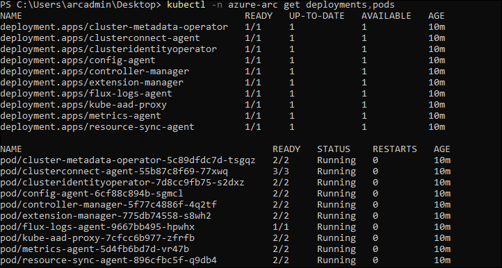
    
    
 1. Navigate to the Resource Group from the Azure portal navigation pane and click on the Resource Group named azure-arc. Look for the resource named **Arc-Data-Demo** of resource type Azure Arc enabled Kubernetes resource.

     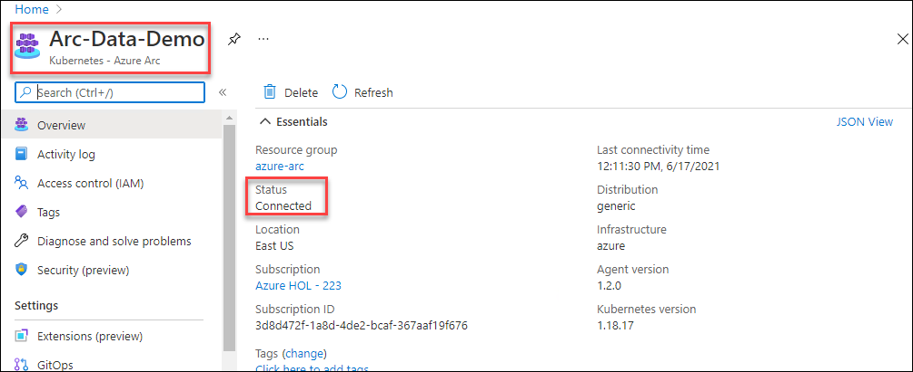
        
 # Create custom location of Arc Cluster. 
 
 1. Now run the below command to enable features to create the custom location:

    ```
    az connectedk8s enable-features -n Arc-Data-Demo -g azure-arc --features cluster-connect custom-locations
    
    ```
    The output should be similar as shown below:
    
    
    
    
    > **Note:** Custom Locations feature is dependent on the Cluster Connect feature. So both features have to be enabled for custom locations to work.Also az connectedk8s enable-features needs to be run on a machine where the kubeconfig file is pointing to the cluster on which the features are to be enabled.
    
 1. Now run the below command to deploy the extenstion of Azure Arc enabled Data Services on Azure Arc kubernetes cluster.
  
     ```
    az k8s-extension create --name azdata --extension-type microsoft.arcdataservices --cluster-type connectedClusters -c Arc-Data-Demo -g azure-arc --scope cluster --release-namespace arc --config Microsoft.CustomLocation.ServiceAccount=sa-bootstrapper
     
     ```
 1. After running the above command you will notive that the **Installstate** in still pending, this is because the extension will take a few minutes to complete the installation.

    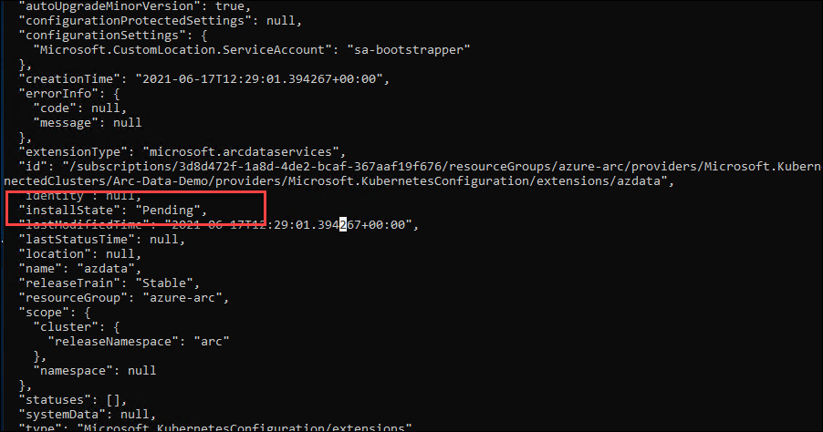

 1. To verify the extension installation, Switch back to browser and search for **Kuberenetes - Azure Arc** and select your cluster.

 1. Now select **Extension (preview)** from left side menu and check if the Install status in **Installed** or not, if not please refresh after sometime and then check.

    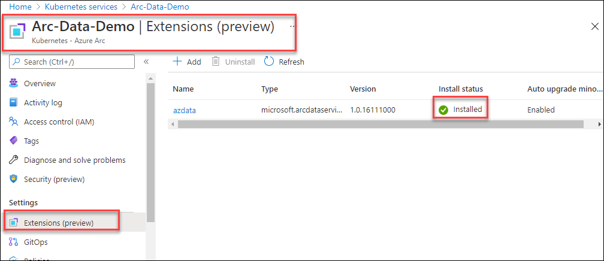

 
 1. Now run the below command to get the Azure Resource Manager identifier of the Azure Arc enabled Kubernetes cluster, you will be using the cluster id in later steps while creating the custom location.

    ```  
    $clusterID = az connectedk8s show -n Arc-Data-Demo -g azure-arc  --query id -o tsv
    $clusterID
    ```
    > **Note:** The clusterID is stored in $clusterID parameter and you will be using this parameter only in later steps. 
    
    
    
 1. Now run the below command to get the Azure Resource Manager identifier of the cluster extension deployed on top of Azure Arc enabled Kubernetes cluster, referenced in later steps as extensionId:

    ```
    $extensionID = az k8s-extension show --name azdata --cluster-type connectedClusters -c Arc-Data-Demo -g azure-arc  --query id -o tsv
    $extensionID
    ```
      > **Note:** The extension resource ID is stored in $extensionID parameter and you will be using this parameter only in later steps.
    
     
    
 1. Now run the below command to create custom location by referencing the Azure Arc enabled Kubernetes cluster ID and the extension ID.

    ```  
    az customlocation create -n azurearc-customlocation -g azure-arc --namespace arcdc --host-resource-id $clusterID --cluster-extension-ids $extensionID
    
    ```
    
    The output should be similar as shown below:
     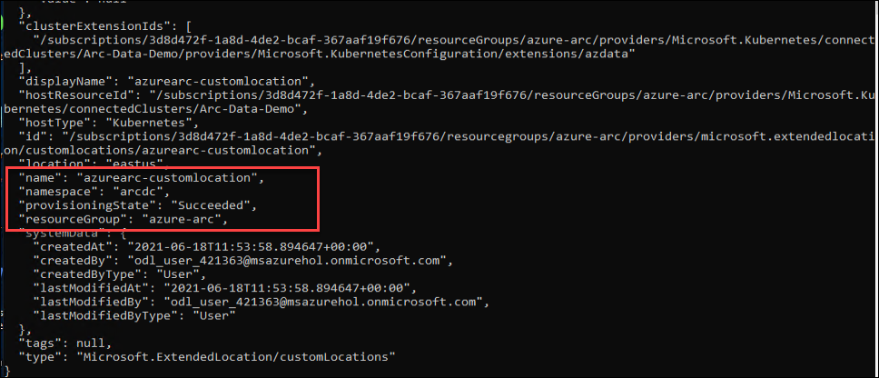
     
 1. To verify the custom location deployment, Switch back to the browser and login to portal.azure.com if not already done.

 1. Search for custom location in search bar and select custom locations. 

     
      
 1. After selecting the custom locations from search bar, Select your **azurearc-customlocation** and explore the overview section.

     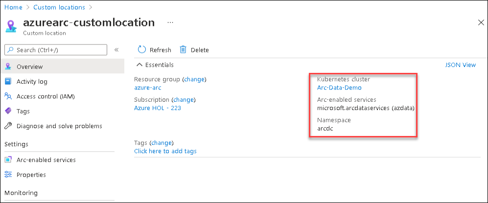
     
     You can see the namespace and kubernetes cluster details on overview page.
     
Task 3: Deploy Azure Arc Data Controller from Azure Portal.

1. From the Azure Portal, search for ```Azure arc data controller``` from the search box and then click on it.  

   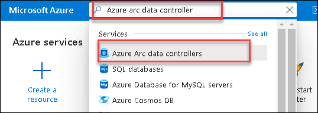
 
1. After select the Azure Arc data controller click on ** + Create** button to deploy ```Azure arc data controller```.

    
     
1. Now, on ```Create Azure Arc data controller``` blade select **Azure Arc-enabled Kubernete (direct mode)**. and click on **Next: Data Controller details**.

    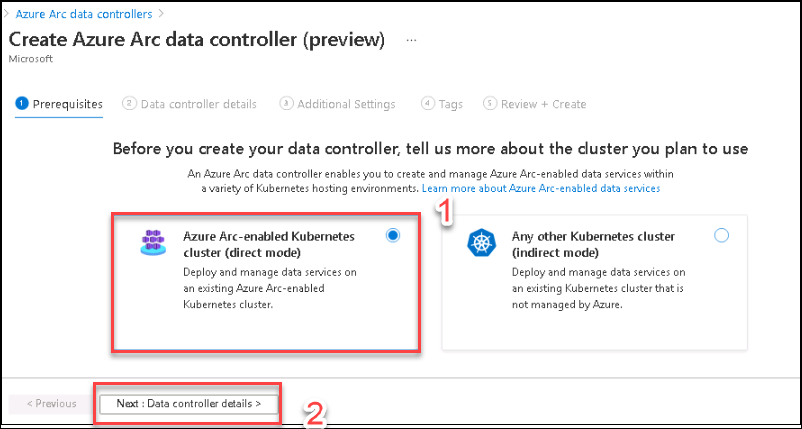
   
1. On **Data controller details** blade enter the following  details:

   * Select the available subscription from drop down.
   * Resource Group: Select **Azure-arc** from drop down.
   * Data Controller Name: arcdc
   * Custom location: Select the available custom location from drop down.

      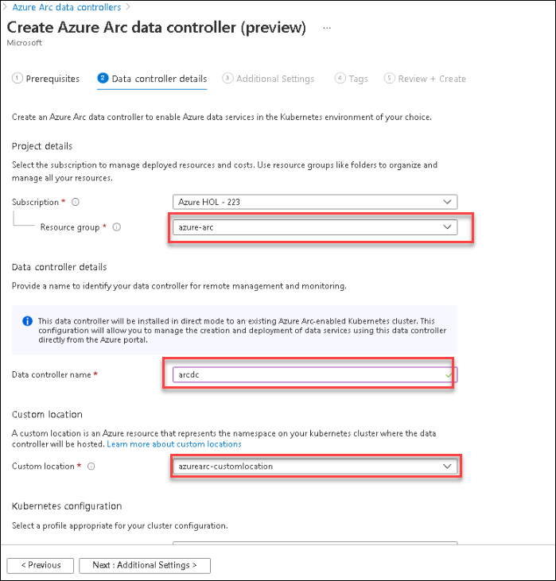
      
   Now scroll down and enter the below details in the remaining sections.
   
   Under Kubernetes configuration enter the details below
   * Kubernetes configuration template: Select **azure-arc-aks-default-storage** from drop down.
   * Data Storage class: Leave default
   * Log Storage class: Leave default 
   * Service type: Load balancer
   
   Under Administrator account enter the below detals.
   * Data controller login: ``` arcuser ```
   * Password: ``` Password.1!! ```

   Under Upload service principal details enter the details below.
   * Client ID: 
   * Tenant ID: 
   * Authority: leave default
   * Client Secret: 

    
   
   After entering all the required details click on **Next : Additional settings**.

1. In Addintional setting blade, Enter the **Log analytics workspace ID and key** that you copied from previos steps and click on **Next : Tags** button.

    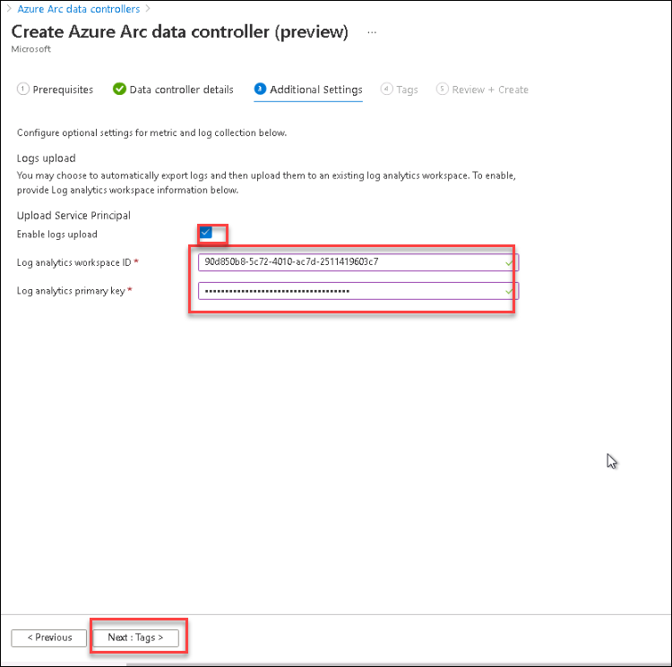
    
1. Leave default on **Tags** blade and click on **Next: Review + Create** button. to start the Azure Arc data controller deployment.

1. On Review + Create blade, you can check all the given details and click on **create** button to start the Azure Arc data controller deployment. 

   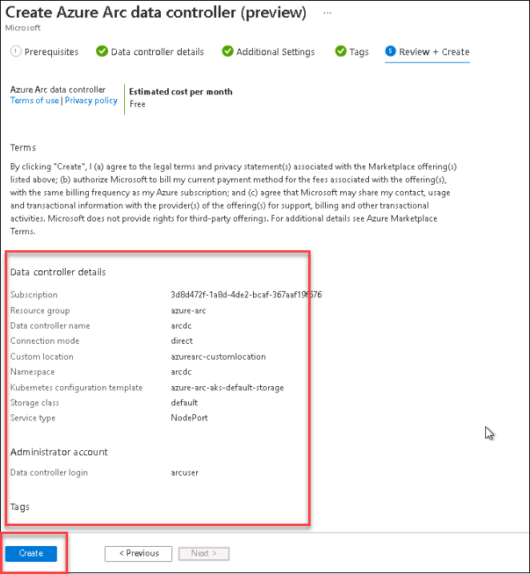
   
1. Once the deployment got completed click on **Go to resource** button.

   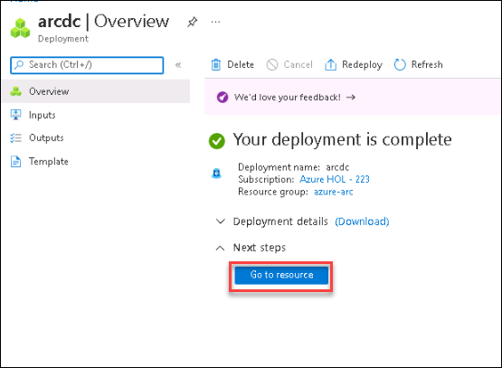
   
1. On Azure Ac data controller resource overview blade, explore the given information about the Namespace and Connection mode.

   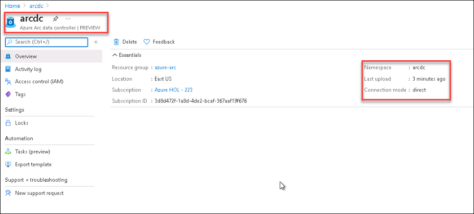
   
  # Monitor the creation of azure Arc data controller on cluster.
   
1. When the Azure portal deployment status shows the deployment was successful, you can check the status of the Arc data controller deployment on the cluster to run the below command on powershell window:

   ```
   kubectl get datacontrollers -n arcdc
   ```
   
## Task 4: Connect to the data controller using Azure Data Studio/ Azure Data CLI.

Now let us connect to the data controller using Azure Data Studio and Azure Data CLI

In the environment provided, the Azure Arc Data controller is already deployed on to the Kubernetes Cluster. We are using **indirect** connectivity mode for the Azure Arc enabled data services environment to Azure.
  
   > ***Info***: There are multiple modes available to connect to Azure. if the Azure Arc enabled data services are directly connected to Azure, then users can use Azure Resource Manager APIs, the Azure CLI, and the Azure portal to operate the Azure Arc data services. The experience in directly connected mode is much like how you would use any other Azure service with provisioning/de-provisioning, scaling, configuring, and so on all in the Azure portal.
   
   If you want to know more about this, refer to the [Connectivity Modes](https://docs.microsoft.com/en-us/azure/azure-arc/data/connectivity)

   First let us see how to connect to the data controller using Azure Data CLI.

1. On your JumpVM, open a **Command Prompt** window from the desktop shortcut if not already opened.

1. Run the following command in the command prompt window.

   ```BASH
   azdata login
   ```
   
   
   
1. When prompted to enter the Namespace, copy the value of Arc DC Name from the Environment details page and paste it in the command prompt. After executing the command, copy the data controller service API endpoint URL value from the output to a **Notepad**.

   
   
   
   
1. Now you are logged in to the Azure Arc data controller. You can minimize the command prompt window.

1. Next, let us see how to connect to Azure Arc Data controller using Azure data studio.

1. On your JumpVM, open **Azure Data studio** from the desktop shortcut and select **Connections**.

   
   
1. In the **Connections** panel under **Azure Arc Controllers**, click on **Connect Controller**.

1. In the **Connect to Controller** page, provide the following details and click on **Connect**.

   - **Controller URL**: Enter the Azure Arc data controller service API endpoint URL value which you copied to **Notepad** earlier 
   
   - **Name** : Enter arcdc
     ```BASH
     arcdc
     ```
   
   - **Username** : Enter arcuser
     ```BASH
     arcuser
     ```
   
   - **Password** : Enter Password.1!!
     ```BASH
     Password.1!!
     ```
   
   - Select the Remember Password checkbox
   
     
    
1. Once the connection is successful, you can see the Azure Arc data controller listed under Azure Arc Controllers on the bottom left of the Azure Data Studio.

    

## Task 5: Monitor with Data Controller Dashboard

Now that you are connected to an Azure Arc data controller, let us view the dashboards for the data controller and any SQL managed instances or PostgreSQL Hyperscale server group resources that you have.

1. In the **Connections** panel, under **AZURE ARC CONTROLLERS**, right-click on the **arcdc** data controller and select **Manage**.

   > **Note**: You will see that there is no Azure Arc Resources. This is because you have not deployed any resource on the Azure Arc data services environment yet. In the next exercises, you will be deploying the resources.

    

1. Once you are in the Azure Arc Data Controller dashboard, you can see following details about the data controller 
   - Name of the Arc Data Controller
   - Region where it is deployed
   - Connection mode
   - Resource Group
   - Subscription ID of the Azure Subscription
   - Controller Endpoint
   - Namespace
   
   You will also see that we have deployed using the Direct connection mode of the Azure Arc Data controller.
